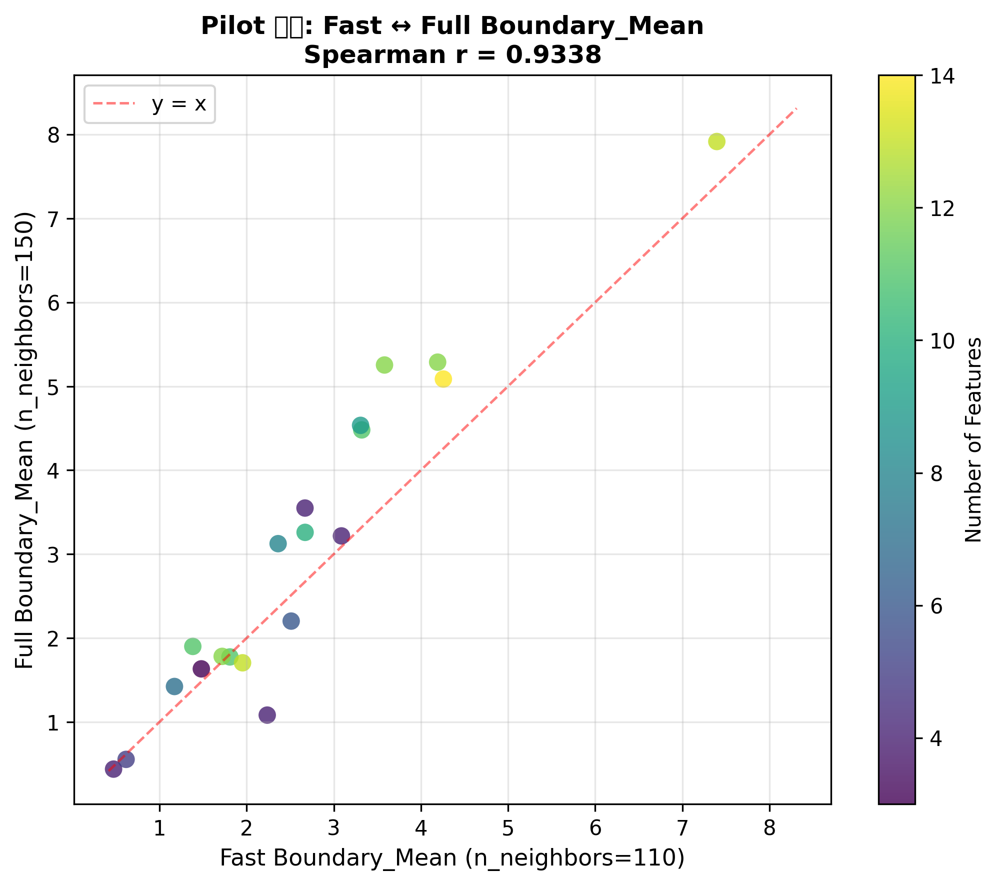
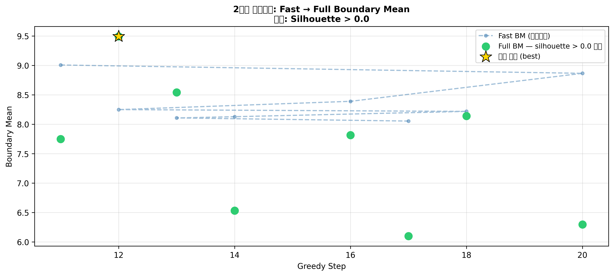
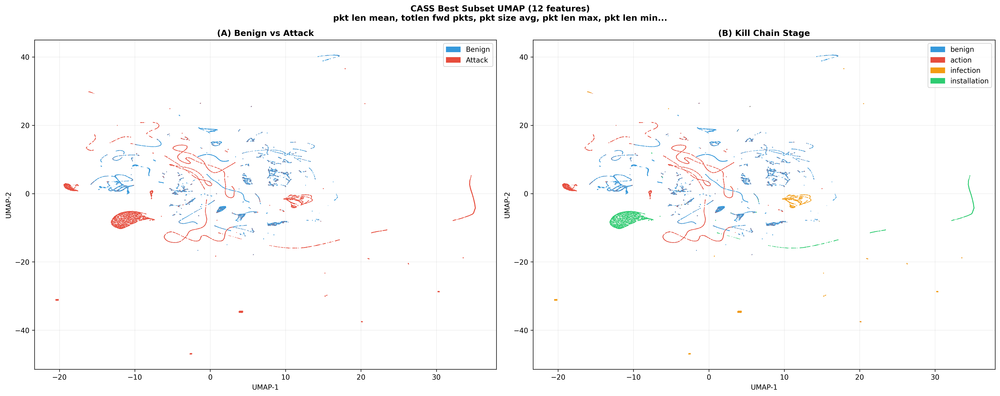
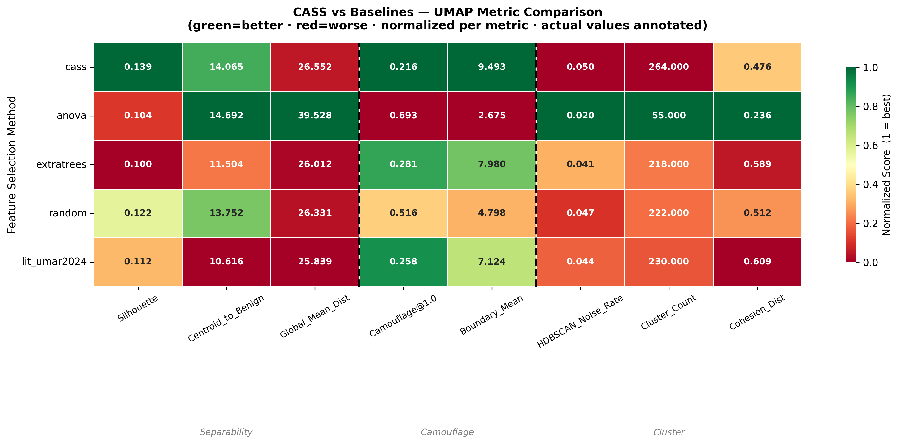
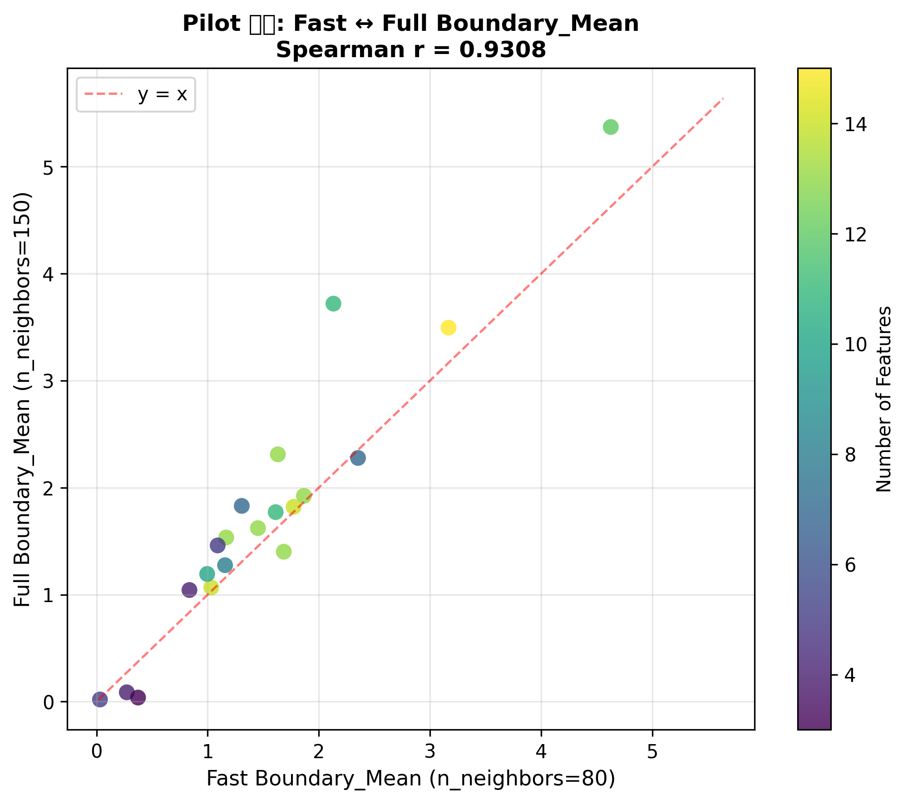
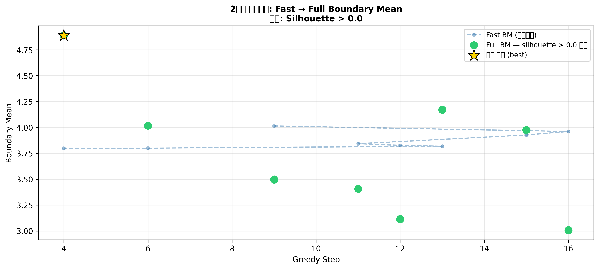
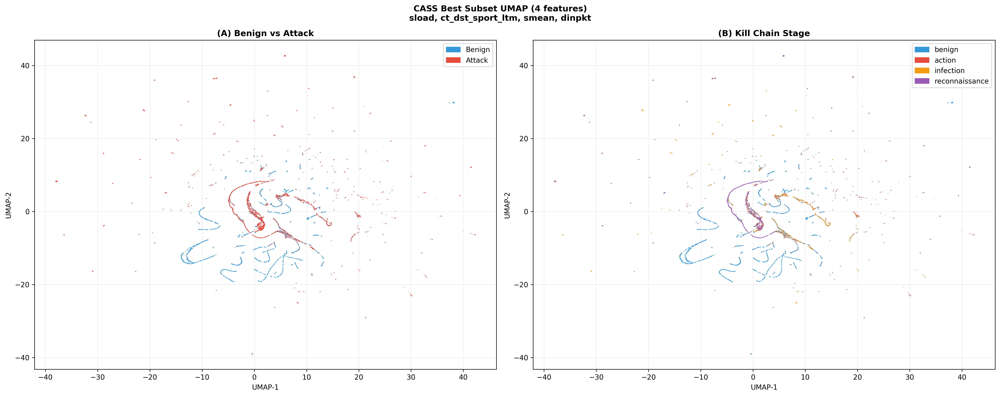
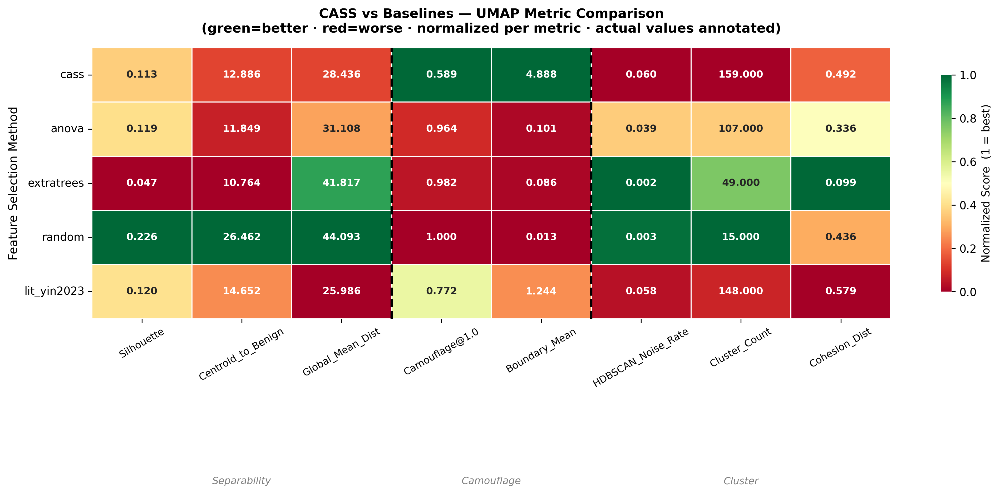

# CASS — Cluster-Aware Feature Selection System


## 개요 (Overview)

**CASS (Cluster-Aware Feature Selection System)** 는 UMAP 기반의 모델 비종속적(model-agnostic) 피처 선택 프레임워크입니다.

### 핵심 가설

> **"저차원 매니폴드 공간(UMAP)에서 공격 트래픽이 정상 트래픽으로 위장하기 어려운(Boundary_Mean 최대화)
> 피처 조합은, 특정 학습 모델에 대한 편향 없이 다양한 ML 탐지 모델에서 높은 성능을 제공한다."**

전통적인 피처 선택(RF 중요도, ANOVA 등)은 특정 모델의 손실 함수나 분포 가정에 의존합니다.
CASS는 **UMAP 공간에서의 Camouflage 최소화(Boundary_Mean 최대화)** 를 평가 기준으로 삼아
어떤 ML 모델에도 bias 없이 일반화되는 피처 부분집합을 탐색합니다.

**목적함수 선택 근거:**
- Silhouette 최대화는 공격 클러스터가 benign 근처에서 "잘 분리된 채로" 위장하는 상황을 허용함
- Boundary_Mean(공격 → nearest benign 평균 거리) 최대화는 위장 자체를 직접 억제함
- 기존 문헌에서 UMAP Camouflage를 피처 선택의 **목적함수**로 사용한 선행 연구 없음 → 새로운 기여
- Silhouette > 0 제약(최소 분리도 보장)으로 클러스터 파편화 방지

---

## 전체 파이프라인 (Pipeline)

```
data/raw/training-flow.csv
         │
         ▼
[Stage 1] 데이터 로드 & UDBB 샘플링
          Benign 60k / Action 20k / Infection 20k / Installation 20k
         │
         ▼
[Stage 2] 전처리
          Inf·NaN → median  |  percentile clipping  |  log1p  |  RobustScaler
         │
         ▼
[Stage 3] Pre-filter
          ExtraTrees 중요도 + ANOVA F-score → 평균 순위 → 상위 K개 선발 (기본 30개)
         │
         ├─ (--pilot) Pilot 검증
         │            무작위 서브셋 20개로 Fast ↔ Full Boundary_Mean 상관 확인
         │            Spearman r ≥ 0.7 이면 Fast BM이 Full BM의 유효한 proxy
         │
         ▼
[Stage 2.7] Reference Camouflage 참고값 계산 (비교용)
            umar2024 피처 조합으로 Full UMAP 실행
            → Camouflage@1.0 실측값 → 비교 참고값으로 저장 (제약으로 사용 안 함)
         │
         ▼
[Stage 4] 2단계 스크리닝 탐색
          ┌─ 1단계: Fast UMAP (n_neighbors=80) 으로 전체 후보 평가
          │         목적함수: Boundary_Mean 최대화 (silhouette > 0 제약)
          │         --mode greedy  : 전진 선택 (피처 1개씩 추가)
          │         --mode random  : 무작위 서브셋 N개 샘플링
          │
          ├─ Elbow 검출: fast_bm 내림차순 gap → 상위 K 결정
          │
          └─ 2단계: Full UMAP (n_neighbors=150) 으로 상위 K 재평가
                    각 서브셋마다 full_sil + boundary_mean + camouflage 계산
                    (동일 임베딩 재사용 — k-NN 1회 추가)
                    │
                    └─ 최종 선택
                         silhouette > 0 을 만족하는 후보 중
                         boundary_mean 최댓값 → best_features 확정
                         (만족 후보 없으면 제약 완화 → 전체 대상 boundary_mean 최댓값)
         │
         ▼
[Stage 5] 시각화 & 저장
          UMAP 산점도 (Benign vs Attack · Kill Chain)
          Fast vs Full Boundary_Mean 비교 플롯
         │
         ├─ (--export) 비교군 Export             [Stage 6 or 5]
         │             5개 비교군 × train/test CSV
         │             training-flow.csv → train_*.csv
         │             test-flow.csv     → test_*.csv  (동일 scaler)
         │
         └─ (--analyze) UMAP 수치 분석           [Stage 6 or 7]
                        5개 비교군 × 8개 지표 계산
                        → comparison_heatmap.png
```

---

## 논문 증명 전략 (Validation Strategy)

### 비교군 구성

동일 피처 수 **N = len(best_features)** 를 고정하여 차원 혼입(confounding)을 제거합니다.
선택 방법의 차이만 순수하게 비교할 수 있습니다.

| 비교군 | 선택 기준 | 피처 수 | 모델 편향 |
|--------|-----------|---------|-----------|
| `cass` | UMAP Boundary_Mean 최대화 (silhouette > 0 제약) | N (자동) | 없음 ← **제안 방법** |
| `anova` | ANOVA F-score 상위 N개 | N | 선형 분리도 가정 |
| `extratrees` | ExtraTrees 중요도 상위 N개 | N | 트리 구조 편향 |
| `random` | 무작위 N개 | N | — (하한 기준선) |
| `lit_umar2024` | Umar et al. (2024) 논문 수동 선정 | 12 (고정) | 도메인 전문가 편향 |

모든 비교군은 동일한 pre-filter 후보 풀(K개)에서 선택됩니다.

> **[추가 분석: N=12 고정 비교]**
> `lit_umar2024`는 피처 수가 12로 고정되어 있어, N이 다른 비교군과 직접 비교 시
> 피처 수 자체의 효과가 혼입(confounding)될 수 있습니다.
> 이를 통제하기 위해 **CASS가 선택한 피처 조합 중 Boundary_Mean 기준 상위 12개만
> 추출한 결과(`cass_n12`)** 도 실험에 포함합니다.
> 이로써 "피처 수를 12로 동일하게 고정했을 때도 CASS 선택 기준이
> 도메인 전문가 수작업(umar2024)보다 우수한가"를 독립적으로 검증합니다.

### UMAP 수치 지표 8개 (`--analyze`)

비교군별 Full UMAP 실행 후 3그룹 8개 지표를 계산하여 정규화 히트맵으로 시각화합니다.

| 그룹 | 지표 | best 방향 | 의미 |
|------|------|-----------|------|
| **Separability** | Silhouette | ↑ | 클래스 간 분리도 |
| | Centroid_to_Benign | ↑ | 공격-정상 무게중심 거리 |
| | Global_Mean_Dist | ↑ | 공격-정상 전체 평균 거리 |
| **Camouflage** | Camouflage@1.0 | ↓ | benign 근방에 숨은 공격 비율 |
| | Boundary_Mean | ↑ | 공격→nearest benign 평균 거리 |
| **Cluster** | HDBSCAN_Noise_Rate | ↓ | 군집되지 않은 공격 포인트 비율 |
| | Cluster_Count | ↓ | 공격 클러스터 수 (적을수록 응집) |
| | Cohesion_Dist | ↓ | 클러스터 내 평균 분산 거리 |

히트맵은 열별로 0~1 정규화 후 **1 = best** 방향으로 통일하며, 셀에 실제 값을 함께 표기합니다.
CASS 행이 전반적으로 높은 수치를 보이면 **"UMAP 기반 선택이 기하 구조적으로도 우수하다"** 는 논문 주장을 시각적으로 증명합니다.

### ML 교차 비교 (`--export`)

`--export`로 생성된 CSV를 외부 ML 모델(XGBoost, RF, LSTM 등)에 직접 입력합니다.
UMAP이 test 데이터를 보지 않으므로 data leakage가 없습니다.

```
train_*.csv  ←  UDBB 샘플 (120k행, 훈련 데이터 scaler fit)
test_*.csv   ←  test-flow.csv 전체 (동일 scaler transform, 완전 분리)
```

---

## 실험 결과 (Experimental Results — CICIDS2018)

> **실행 환경**: CICIDS2018, UDBB 샘플링 120k행, `--pilot --export --analyze`, greedy mode, top-k=30

### Pilot 검증 — Fast ↔ Full Boundary_Mean 상관



| 항목 | 값 |
|------|----|
| Spearman r | **0.9338** |
| Fast n_neighbors | 110 (base 80 → 재시도 1회로 자동 조정) |
| Full n_neighbors | 150 |
| 판정 | ✓ Fast BM이 Full BM의 유효한 proxy (r ≥ 0.7) |

base n_neighbors=80에서 r<0.7이 나와 `pilot_validation_with_retry`가 80→110으로 자동 조정한 후 통과. 이후 모든 Fast 스크리닝은 n_neighbors=110으로 진행됨.

---

### 2단계 스크리닝 — Fast → Full Boundary_Mean



Elbow K=8이 결정되어 전체 20 스텝 중 **fast_bm 상위 8개(스텝 11~20)만 Full 재평가**됨.

| Fast 순위 | Step | Fast BM | Full BM | 비고 |
|----------|------|---------|---------|------|
| 1위 | 11 | 9.008 | 7.750 | Full에서 4위로 하락 |
| 2위 | 20 | 8.866 | 6.298 | Full에서 7위로 하락 |
| **5위** | **12** | **8.250** | **9.493** | **→ Full 1위로 역전, 최종 선택** |
| 7위 | 13 | 8.108 | 8.543 | Full에서 2위로 상승 |

**2단계 스크리닝의 필요성 직접 입증**: Fast 1위(step 11)를 그대로 선택했다면 Full BM 7.75에 그쳤으나, Full 재평가를 통해 실제 최적(9.49)을 발견함.

---

### CASS 최적 피처 UMAP 시각화 (12 features)



**선택된 12개 피처:**

| 그룹 | 피처 |
|------|------|
| 패킷 크기 (6개) | pkt len mean, pkt len max, pkt len min, pkt size avg, bwd pkt len min, fwd pkt len max |
| 기타 (6개) | totlen fwd pkts, dst port, init bwd win byts, flow iat mean, fwd seg size min, fwd iat mean |

- **(A) Benign vs Attack**: 공격(적색)이 정상(청색) 공간 전반에 분산 — 실제 NIDS 환경의 위장 패턴 반영
- **(B) Kill Chain Stage**: installation(초록)은 명확히 분리; action·infection은 benign과 혼재 → 단계별 탐지 난이도 차이 시각적 확인

---

### 비교군 UMAP 지표 히트맵



**수치 원본 (comparison_metrics.csv, n_features=12 동일 조건):**

| 그룹 | Silhouette↑ | Centroid↑ | Global_Dist↑ | **BM↑** | **Cam@1.0↓** | Noise↓ | Clusters↓ | Cohesion↓ |
|------|------------|-----------|-------------|---------|-------------|--------|-----------|----------|
| **cass** | **0.139** | 14.065 | 26.552 | **9.493** | **0.216** | 0.050 | 264 | 0.476 |
| anova | 0.104 | **14.692** | **39.528** | 2.676 | 0.693 | **0.020** | **55** | **0.236** |
| extratrees | 0.100 | 11.504 | 26.012 | 7.980 | 0.281 | 0.041 | 218 | 0.589 |
| random | 0.122 | 13.753 | 26.331 | 4.798 | 0.516 | 0.047 | 222 | 0.512 |
| lit_umar2024 | 0.112 | 10.616 | 25.839 | 7.124 | 0.258 | 0.044 | 230 | 0.609 |

#### 핵심 결과 해석

**CASS는 핵심 목적함수(Boundary_Mean, Camouflage)에서 명확히 1위:**
- Boundary_Mean: 9.493 → umar2024 대비 **+33%**, extratrees 대비 **+19%**
- Camouflage@1.0: 0.216 → umar2024(0.258) 대비 공격의 **16%p 더 적게 위장**
- Silhouette: 0.139 → 5개 비교군 중 **1위**

**ANOVA의 역설**: Global_Mean_Dist(39.5), Centroid(14.7), Cluster_Count(55)에서 1위이지만 Boundary_Mean 2.676(꼴찌), Camouflage@1.0 0.693(꼴찌). 공격 클러스터의 **거시적 무게중심**은 benign에서 멀지만, **경계 영역에 침투한 공격 포인트**는 방치함.

**Cluster_Count에 대하여**: CASS는 264로 최대값. CASS는 공격 클러스터의 내부 응집도가 아닌 **benign 경계로부터의 분리**를 최적화하므로, 공격이 넓게 분산되는 것은 설계 특성이며 약점이 아님.

---

### Silhouette 절대값에 관한 해석

CASS의 Silhouette 0.139는 5개 비교군 중 최고값이지만, 절대 수치가 낮아 보일 수 있다. 이는 CASS의 한계가 아니라 **데이터와 평가 지표의 특성**에서 기인한다.

**Silhouette의 구조적 한계 (NIDS 맥락):**
Silhouette은 *전역적(global)* 클러스터 분리도를 측정한다. 즉, 각 포인트가 동일 클래스 내부와 반대 클래스 전체와의 평균 거리 비교를 기반으로 한다. 그러나 실제 위장 공격(Camouflage Attack)의 위협은 **전역적 분리가 아니라, 공격 트래픽 일부가 benign 경계 근방에 국소적(locally)으로 침투하는 것**이다.

- Silhouette이 높더라도: 공격 클러스터의 일부가 benign 영역 가장자리에 밀착해 있으면 탐지 모델이 misclassify할 수 있다.
- Boundary_Mean은 이 **경계 침투를 직접 측정**한다 — 각 공격 포인트에서 가장 가까운 benign까지의 거리.

ANOVA 결과가 이 차이를 실증한다: Silhouette 0.104(4위)이지만 Cluster_Count 55(1위)로 거시적 분리는 우수 → 그러나 Camouflage@1.0 0.693으로 경계 침투는 최악. 반대로 CASS는 Silhouette 0.139(1위)이면서 Camouflage@1.0 0.216(1위)으로 지역적 경계 분리에서 압도적.

> **결론:** 피처 선택의 목적이 "NIDS에서 위장 공격 억제"라면, 전역 분리도(Silhouette)보다 경계 근방 분리도(Boundary_Mean, Camouflage)가 더 적합한 평가 지표다. CASS는 이 지표를 직접 목적함수로 삼았으며, 결과적으로 모든 관련 지표에서 1위를 달성했다.

> Kuppa et al.은 NIDS 이상 탐지에서 *"decision boundaries of nominal and abnormal classes are not very well defined"* 임을 지적하며, 공격자가 benign 경계 근방의 불명확한 영역을 통해 탐지를 우회함을 CSE-CIC-IDS2018 실험으로 실증했다 [Kuppa et al., 2019]. Silhouette은 명확한 클러스터 경계를 가정한 전역 지표이므로 이러한 경계 근방 공격을 포착하지 못하며, Boundary_Mean이 더 적합한 평가 지표임을 지지한다.
>

---

## 실험 결과 (Experimental Results — UNSW-NB15)

> **실행 환경**: UNSW-NB15, UDBB 샘플링 60k행, `--pilot --export --analyze`, greedy mode, top-k=30
>
> **데이터셋 분할**: training-flow.csv (175,341행, 원논문 훈련셋) / test-flow.csv (82,332행, 원논문 테스트셋)
> ※ Kaggle 다운로드 시 파일명이 뒤바뀌어 배포되므로 `unsw_nb15_download.py`의 FILE_MAP에서 training-set↔testing-set 교차 매핑으로 수정

---

### Pilot 검증 — Fast ↔ Full Boundary_Mean 상관



| 항목 | 값 |
|------|----|
| Spearman r | **0.9308** |
| Fast n_neighbors | 80 (재시도 없이 1회 통과) |
| Full n_neighbors | 150 |
| 판정 | ✓ Fast BM이 Full BM의 유효한 proxy (r ≥ 0.7) |

CICIDS2018(r=0.9338, n_neighbors=110 재시도 필요)과 달리 기본값 80에서 바로 통과. 데이터셋에 따라 Pilot 재시도 발생 여부가 달라질 수 있음을 실증.

---

### 2단계 스크리닝 — Fast → Full Boundary_Mean



Elbow K=8이 결정되어 전체 greedy 스텝 중 **fast_bm 상위 8개만 Full 재평가**됨.

**N=4 수렴 특성:** Greedy fast BM이 step 4 이후 3.8~4.0로 수렴 → Elbow가 step 4에서 발생 → Full 재평가 상위 후보도 4개 피처에서 수렴. CICIDS2018(12개)와 달리 UNSW-NB15에서 4개 피처만으로 최적 경계 분리가 달성되는 것은 **데이터셋 고유의 공격-정상 매니폴드 구조 차이**로 해석됨 (공격 트래픽이 소수의 피처 방향으로 강하게 투영).

---

### CASS 최적 피처 UMAP 시각화 (4 features)



**선택된 4개 피처:**

| 그룹 | 피처 | 의미 |
|------|------|------|
| 트래픽 부하 | `sload` | 소스→목적지 방향 비트레이트 |
| 연결 컨텍스트 | `ct_dst_sport_ltm` | 최근 동일 목적지:소스포트 연결 수 |
| 패킷 크기 | `smean` | 소스 방향 평균 패킷 크기 |
| 패킷 간격 | `dinpkt` | 목적지 방향 패킷 간 평균 시간 |

- **(A) Benign vs Attack**: CICIDS2018 대비 benign-attack 경계가 더 명확하게 분리되는 구조 — 4개 피처만으로도 Boundary_Mean 4.888 달성
- **(B) Kill Chain Stage**: reconnaissance(보라)가 상단에 집중; action/infection은 benign 근방에 일부 산재 → Kill Chain 단계별 위장 패턴 시각적 확인

---

### 비교군 UMAP 지표 히트맵



**수치 원본 (comparison_metrics.csv, n_features=4 동일 조건):**

| 그룹 | Silhouette↑ | Centroid↑ | Global_Dist↑ | **Cam@1.0↓** | **BM↑** | Noise↓ | Clusters↓ | Cohesion↓ |
|------|------------|-----------|-------------|-------------|---------|--------|-----------|----------|
| **cass** | 0.113 | **12.886** | 28.436 | **0.589** | **4.888** | 0.060 | 159 | 0.492 |
| anova | 0.119 | 11.849 | 31.100 | 0.964 | 0.101 | 0.039 | 107 | **0.336** |
| extratrees | 0.047 | 10.764 | 41.817 | 0.982 | 0.086 | **0.002** | **49** | **0.099** |
| random | **0.226** | 26.462 | **44.093** | 1.000 | 0.013 | 0.003 | **15** | 0.436 |
| lit_yin2023 | 0.120 | 14.452 | 25.986 | 0.772 | 1.244 | 0.058 | 148 | 0.579 |

#### 핵심 결과 해석

**CASS는 핵심 목적함수(Boundary_Mean, Camouflage)에서 명확히 1위:**
- Boundary_Mean: **4.888** → lit_yin2023(1.244) 대비 **+293%**, anova(0.101) 대비 **+4740%**
- Camouflage@1.0: **0.589** → lit_yin2023(0.772) 대비 공격의 **18.3%p 더 적게 위장**
- Centroid_to_Benign: **12.886** (5개 비교군 중 2위, lit_yin2023 14.452 다음)

**"Random 역설" (CICIDS2018의 ANOVA 역설과 구조 동일):**
Global_Mean_Dist(44.093)와 Centroid(26.462)에서 1위이지만 Camouflage@1.0이 1.000(최악), BM=0.013(최악).
무작위 피처는 공격 클러스터의 **거시적 분산**은 극대화하지만 benign 경계 근방에 침투한 공격 포인트는 방치함. 이는 CICIDS2018에서 ANOVA가 보인 역설과 동일한 구조로, 두 데이터셋에 걸쳐 **"거시적 거리 ≠ 경계 분리"** 가 재현됨.

**lit_yin2023 (20 수치형 피처):**
CASS N=4 대비 5배 많은 피처를 사용하면서도 BM=1.244(2위)로 CASS에 크게 뒤짐. 도메인 전문가 수작업(IGRF-RFE 기반)으로도 UMAP 경계 분리 관점에서는 CASS의 자동 탐색에 미치지 못함을 실증.

**Cluster_Count에 대하여**: CASS의 159는 anova(107)·extratrees(49)보다 많음. Silhouette 제약하에 Boundary_Mean을 최적화하면 공격이 benign 경계에서 밀려나면서 다양한 방향으로 분산 — 클러스터 수 증가는 경계 분리의 부산물이며 탐지 성능의 약점이 아님 (CICIDS2018 분석과 일관).

---

## 프로젝트 구조 (Directory Structure)

```
CASS/
├── data/
│   ├── raw/
│   │   ├── cicids2018/
│   │   │   ├── training-flow.csv      # CICIDS2018 훈련 원본 (76 피처 + 레이블)
│   │   │   ├── test-flow.csv          # CICIDS2018 테스트 원본 (완전 분리 보관)
│   │   │   └── cicids2018_download.py # Kaggle 다운로드 & 변환 스크립트
│   │   └── unsw_nb15/
│   │       ├── training-flow.csv      # UNSW-NB15 훈련 원본 (42 피처 + 레이블)
│   │       ├── test-flow.csv          # UNSW-NB15 테스트 원본 (완전 분리 보관)
│   │       └── unsw_nb15_download.py  # Kaggle 다운로드 & 변환 스크립트
│   └── processed/
│       └── cicids2018_processed.csv   # 전처리 완료 (자동 생성)
├── src/
│   ├── config.py        # 전역 설정 — UMAP 파라미터, 경로, 샘플링 수, 데이터셋별 설정
│   ├── data_loader.py   # 로드 + UDBB 샘플링 + 전처리 파이프라인
│   ├── pre_filter.py    # ExtraTrees + ANOVA 평균 순위 기반 사전 필터링
│   ├── evaluator.py     # UMAP 차원 축소 + Silhouette Score (cuML GPU)
│   ├── search_algo.py   # 2단계 스크리닝 (Greedy/Random + Elbow + Full 재평가)
│   ├── exporter.py      # 비교군 구성 + train/test CSV 생성
│   └── analyzer.py      # 비교군별 8개 UMAP 지표 계산 + 히트맵
├── notebooks/
│   ├── 01_eda_and_preprocessing.ipynb
│   └── 02_silhouette_analysis.ipynb
├── results/             # 모든 출력 자동 저장 (gitignore 처리)
│   ├── cicids2018/      # CICIDS2018 실험 결과
│   │   ├── figures/
│   │   ├── logs/
│   │   └── exports/
│   └── unsw_nb15/       # UNSW-NB15 실험 결과
│       ├── figures/
│       ├── logs/
│       └── exports/
├── main.py              # CLI 진입점
├── make_test_exports.py # 로컬 test CSV 생성 스크립트 (대용량 파일 청크 처리)
└── requirements.txt
```

UNSW-NB15 원본 데이터는 CASS 내부 경로에서 참조합니다:

```
data/raw/unsw_nb15/
├── training-flow.csv         # UNSW-NB15 훈련 원본 (42 피처 + 레이블, 175k행)
├── test-flow.csv             # UNSW-NB15 테스트 원본 (완전 분리 보관, 82k행)
└── unsw_nb15_download.py     # Kaggle 다운로드 & 변환 스크립트
```

`unsw_nb15_download.py`를 `data/raw/unsw_nb15/` 에서 실행하면 Kaggle(`mrwellsdavid/unsw-nb15`)에서 자동으로 다운로드 및 변환됩니다.

---

## 실행 가이드 (Execution Guide)

### 1단계 — 환경 설정

```bash
# cuML (RAPIDS) — GPU UMAP 필수
conda install -c rapidsai -c conda-forge cuml=26.2.0 python=3.10 cudatoolkit=12.x

# 나머지 의존성
pip install -r requirements.txt
```

### 2단계 — 데이터 준비

**CICIDS2018**
```
data/raw/cicids2018/training-flow.csv   # 컬럼: 피처 76개 + attack_flag + attack_step
data/raw/cicids2018/test-flow.csv       # 동일 컬럼 구조
```
`attack_step`: `benign` · `action` · `infection` · `installation`

데이터가 없는 경우 `data/raw/cicids2018/cicids2018_download.py`를 실행하면 Kaggle에서 자동 다운로드됩니다.

**UNSW-NB15**
```
data/raw/unsw_nb15/training-flow.csv   # 피처 39개(수치형) + attack_flag + attack_step
data/raw/unsw_nb15/test-flow.csv       # 동일 컬럼 구조
```
`attack_step`: `benign` · `action` · `infection` · `reconnaissance`
(`lateral-movement`, `installation` 제외 — 소수 샘플 및 PCA leakage 확인)

데이터가 없는 경우 `data/raw/unsw_nb15/unsw_nb15_download.py`를 실행하면 Kaggle(`mrwellsdavid/unsw-nb15`)에서 자동 다운로드됩니다.

`attack_flag`: 0 = benign, 1 = attack (공통)

### 3단계 — 파이프라인 실행

목적에 따라 플래그를 조합합니다.

```bash
# ── CICIDS2018 (기본값) ──────────────────────────────────────
python main.py --pilot --export --analyze

# ── UNSW-NB15 ───────────────────────────────────────────────
python main.py --dataset unsw_nb15 --pilot --export --analyze

# ── 탐색 방식 변경 ──────────────────────────────────────────
python main.py --dataset unsw_nb15 --mode random --n-subsets 100
python main.py --dataset unsw_nb15 --top-k 15

# ── 개별 플래그 ─────────────────────────────────────────────
python main.py --dataset unsw_nb15 --pilot    # Fast↔Full 상관 사전 확인
python main.py --dataset unsw_nb15 --export   # 비교군 train/test CSV
python main.py --dataset unsw_nb15 --analyze  # 8지표 히트맵
```

### CLI 플래그 전체 목록

| 플래그 | 기본값 | 설명 |
|--------|--------|------|
| `--dataset` | `cicids2018` | 데이터셋 선택 (`cicids2018` / `unsw_nb15`) |
| `--mode` | `greedy` | 탐색 방식 (`greedy` / `random`) |
| `--top-k` | `30` | Pre-filter 후 유지할 피처 수 |
| `--n-subsets` | `80` | random 모드 평가 서브셋 수 |
| `--pilot` | off | Fast↔Full Boundary_Mean 상관 사전 검증 |
| `--export` | off | 비교군별 train/test CSV 저장 |
| `--analyze` | off | 비교군별 8지표 계산 + 히트맵 저장 |

### 4단계 — 출력 결과 확인

결과는 데이터셋별로 분리된 디렉토리에 저장됩니다.

```
results/
├── cicids2018/          # --dataset cicids2018 결과
│   ├── figures/
│   │   ├── umap_best_subset.png            # CASS 최적 피처 UMAP 시각화
│   │   ├── two_phase_screening.png         # Fast vs Full BM 비교
│   │   ├── pilot_fast_vs_full.png          # (--pilot) Pilot 검증 산점도
│   │   ├── best_subset_umap_embeddings.csv
│   │   └── comparison_heatmap.png          # (--analyze) 비교군 × 8지표 히트맵
│   ├── logs/
│   │   ├── pre_filter_ranking.csv
│   │   ├── search_results_greedy.csv
│   │   ├── pilot_validation.csv
│   │   └── comparison_metrics.csv
│   └── exports/                            # (--export) ML 학습용 CSV
│       ├── train_cass.csv / test_cass.csv
│       ├── train_anova.csv / test_anova.csv
│       ├── train_extratrees.csv / test_extratrees.csv
│       ├── train_random.csv / test_random.csv
│       └── train_lit_umar2024.csv / test_lit_umar2024.csv
└── unsw_nb15/           # --dataset unsw_nb15 결과 (동일 구조)
    ├── figures/
    ├── logs/
    └── exports/
```

---

## 알고리즘 상세 (Algorithm Details)

### 전처리 파이프라인

`data_loader.py`의 `preprocess()` 함수가 실행하는 4단계 파이프라인입니다.

```
① Inf / NaN → 열별 중앙값(median) 대체
   (inf, -inf, -1 모두 NaN 처리 후 열별 median으로 imputation)

② Percentile Clipping (이상치 제거)
   - log 변환 대상 피처 (skewed): clip(lower=0, upper=0.99분위)
   - 나머지 피처:                  clip(lower=0.01분위, upper=0.99분위)

③ log1p 변환 (log 피처만 적용)
   X[col] = log(1 + X[col])   — 0-safe, 음수 불가

④ RobustScaler 정규화
   X_scaled = (X - median) / IQR   (중앙값 기준, 이상치 내성)
```

**log1p 적용 피처 목록 (49개, `LOG_FEATURES`):**

| 그룹 | 피처 |
|------|------|
| 패킷 수/바이트 | tot fwd/bwd pkts · totlen fwd/bwd pkts |
| 패킷 길이 | fwd pkt len max/min/mean/std · bwd pkt len max/min/mean/std |
| | pkt len min/max/mean/std/var · pkt size avg · fwd/bwd seg size avg |
| 처리율 | flow byts/s · flow pkts/s · fwd/bwd pkts/s |
| IAT | flow iat mean/std/max · fwd iat tot/mean/std/max · bwd iat tot/mean/std/max |
| 헤더/윈도우 | fwd/bwd header len · init fwd/bwd win byts |
| 서브플로우 | subflow fwd/bwd pkts · subflow fwd/bwd byts |
| Active/Idle | active mean/std/max · idle mean/std/max |

---

### Pre-filter 결합 공식

ExtraTrees 중요도 순위 `r_tree(f)` 와 ANOVA F-점수 순위 `r_anova(f)` 를 단순 평균 순위로 결합합니다.

```
avg_rank(f) = ( r_tree(f) + r_anova(f) ) / 2

  r_*(f) : 해당 지표 내림차순 정렬 시 피처 f의 0-based 순위
           (중요도·F-score가 가장 높은 피처 = 0)

상위 K = TOP_K_PREFILTER(기본 30)개를 avg_rank 오름차순으로 선발
```

두 방법을 동등하게 결합하여 트리 구조 편향(ExtraTrees)과 선형 분리도 가정(ANOVA)을 상호 보완합니다.

---

### 최적 서브셋 선택 (Boundary_Mean Maximization)

CASS의 핵심 기여는 **"UMAP 공간에서 Camouflage가 낮은(Boundary_Mean이 높은) 피처 조합이 ML 탐지 성능도 높다"** 는 주장입니다. Boundary_Mean을 직접 목적함수로 삼아 공격 트래픽의 위장을 억제하는 피처 조합을 탐색합니다.

#### 선택 절차

```
Step 1 — 1단계 Fast 스크리닝
  각 후보 서브셋에 Fast UMAP 적용
  → silhouette > MIN_SILHOUETTE(0.0) 를 만족하는 경우에만
    Boundary_Mean 계산 → 최댓값 기준으로 탐색 방향 결정
  (제약 미충족 시 silhouette 제약 완화 후 Boundary_Mean으로 fallback)

Step 2 — Elbow 검출
  fast_bm 내림차순 gap 분석 → 상위 K 결정

Step 3 — 2단계 Full 재평가
  상위 K개에 Full UMAP 적용
  → full_sil + boundary_mean + camouflage 동시 계산

Step 4 — 최종 선택
  survived = { subset : full_sil > MIN_SILHOUETTE }
  best = argmax boundary_mean  over survived
  (survived 가 공집합이면 제약 완화 → 전체 Top-K 대상 argmax로 fallback)
```

#### 수식

```
best_features = argmax  Boundary_Mean(UMAP_full(X[S]))
                S ∈ TopK
                subject to  Silhouette(UMAP_full(X[S])) > MIN_SILHOUETTE(0.0)
```

#### 논문 방어 논리

> *"We select the feature subset that maximizes the mean distance from attack points
> to their nearest benign neighbor in UMAP space (Boundary_Mean), subject to a minimum
> separability constraint (Silhouette > 0). This directly minimizes the camouflage rate
> without relying on any externally tuned threshold, as Silhouette > 0 is a
> model-free, parameter-free condition meaning attack clusters are closer to each other
> than to benign clusters."*

- **하이퍼파라미터 없음**: Boundary_Mean은 직접 최대화, Silhouette > 0은 고정된 수학적 조건 (튜닝 불필요)
- **선행 연구와의 차별점**: 기존 연구는 camouflage를 측정 지표로만 활용; CASS는 이를 **탐색 목적함수**로 직접 사용
- **파편화 방지**: Silhouette > 0 제약으로 extratrees의 Cluster_Count=218 같은 과도한 파편화 억제

---

### Elbow 검출 알고리즘

`search_algo.py`의 `find_elbow()` 함수입니다. Fast Boundary_Mean 점수의 내림차순 정렬 후 다음 조건으로 Elbow K를 결정합니다.

```
scores_desc = [s_1 ≥ s_2 ≥ ... ≥ s_n]  (Fast Boundary_Mean 내림차순)

gaps[i] = |s_i - s_{i+1}|               (인접 점수 차이, i = 1..n-1)
max_gap  = max(gaps)
threshold = max_gap × ELBOW_GAP_RATIO   (기본 0.1)

K = 첫 번째 i where gaps[i] < threshold  (0-based: K = i+1)
K = max(K, ELBOW_MIN_K)                 (최소 8 보장)
K = n  if 조건 미발생                   (모두 Full 재평가)
```

**직관:** Boundary_Mean 점수가 급격히 떨어지기 시작하는 "절벽" 직전 지점을 Elbow로 보고, 그 위의 서브셋만 Full UMAP으로 재평가합니다.

---

### Silhouette Score 서브샘플링

Silhouette는 O(n²) 연산이므로, 10,000개 초과 시 무작위 서브샘플로 근사합니다.

```python
# evaluator.py / analyzer.py 공통 적용
if n > 10_000:
    idx = rng.choice(n, 10_000, replace=False)
    sil = silhouette_score(emb[idx], y[idx], metric="euclidean")
```

---

### 비교군 구성 로직 (`exporter.py`)

N = `len(best_features)` 로 모든 비교군의 피처 수를 동일하게 고정합니다.

| 비교군 | 선택 방법 | 소스 풀 |
|--------|-----------|---------|
| `cass` | UMAP Boundary_Mean 최적화 결과 | — |
| `anova` | `filter_summary`를 ANOVA_F 내림차순 재정렬 → 상위 N개 | Pre-filter 풀 (K개) |
| `extratrees` | `filter_summary`를 Tree_Importance 내림차순 재정렬 → 상위 N개 | Pre-filter 풀 (K개) |
| `random` | `random.sample(candidate_pool, N)` — seed=RANDOM_SEED+1000 | Pre-filter 풀 (K개) |
| `lit_<name>` | `LITERATURE_BASELINES[name]` 수동 정의 (데이터셋 내 존재하는 것만) | 전체 피처 |

> **중요:** anova / extratrees 비교군은 **Pre-filter 후보 풀(K개) 내에서** 재정렬하여 선택합니다. 전체 피처 중 상위 N개가 아닙니다. 동일한 후보 풀 안에서 선택 기준만 달리하여 순수 비교를 보장합니다.

> **[설계 정당화 — Pre-filter 후보 풀 공유]**
> Pre-filter 자체가 ExtraTrees와 ANOVA로 구성되어 있고, `anova`·`extratrees` 비교군도
> 동일한 두 기법을 기반으로 선택되므로 순환 참조처럼 보일 수 있습니다.
> 그러나 이는 의도된 설계입니다.
>
> Pre-filter의 역할은 전체 피처 공간에서 **통계적으로 무의미한 피처를 제거하는 전처리**이며,
> 비교군 선택은 이 걸러진 후보 풀 안에서 **선택 기준의 차이**만을 순수하게 비교하는 단계입니다.
> 모든 비교군이 동일한 후보 풀에서 출발하기 때문에, 피처 공간의 차이 없이
> "어떤 선택 기준이 더 나은 피처 조합을 찾는가"라는 질문에 집중할 수 있습니다.
>
> 이 설계는 *"CASS가 동일한 출발점에서 다른 통계적 방법보다 우수한 피처 조합을 탐색한다"*
> 는 주장을 더 공정하게 검증하며, ANOVA·ExtraTrees 비교군의 성능이 높게 나오더라도
> 이는 Pre-filter의 효과가 아닌 **선택 기준 자체의 우위**로 해석됩니다.

---

### 8개 수치 지표 계산 공식

`analyzer.py`의 `_compute_metrics(emb, y)` — UMAP 2D 임베딩에서 계산합니다.

#### [Separability 그룹]

**① Silhouette Score**
```
s(i) = (b(i) - a(i)) / max(a(i), b(i))

  a(i) : 포인트 i와 동일 클래스 내 나머지 포인트들의 평균 유클리드 거리
  b(i) : 포인트 i와 반대 클래스 포인트들의 평균 유클리드 거리

Silhouette = mean( s(i) for all i )   ∈ [-1, 1]
```

**② Centroid_to_Benign**
```
c_B = mean(emb[y == 0], axis=0)   # benign 무게중심
c_A = mean(emb[y == 1], axis=0)   # attack 무게중심

Centroid_to_Benign = ||c_A - c_B||_2
```
두 클래스 무게중심 간 유클리드 거리. 클러스터가 멀리 분리될수록 큰 값.

**③ Global_Mean_Dist**
```
A_sub ⊆ attack_pts  (최대 5,000개 서브샘플)
B_sub ⊆ benign_pts  (최대 5,000개 서브샘플)

Global_Mean_Dist = mean( ||a - b||_2  for all a ∈ A_sub, b ∈ B_sub )
```
공격-정상 간 쌍별(pairwise) 거리의 전체 평균. 메모리 제어를 위해 서브샘플.

---

#### [Camouflage 그룹]

**④ Boundary_Mean**
```
NearestNeighbors(n_neighbors=1).fit(benign_pts)
nn_dists[i] = min( ||attack_pts[i] - b||_2  for b ∈ benign_pts )

Boundary_Mean = mean(nn_dists)
```
각 공격 포인트에서 가장 가까운 정상 포인트까지의 거리 평균. 클수록 공격이 정상 영역에서 멀리 분리됨.

**⑤ Camouflage@t**
```
Camouflage@t = mean( nn_dists[i] ≤ t )   (비율, 0~1)
```
benign 근방 반경 t 이내에 위치한 공격 포인트 비율. 작을수록 위장 공격이 적음.
기본값: t = 1.0 (`CAMOUFLAGE_THRESHOLDS = [1.0]`).

---

#### [Cluster 그룹]

공격 포인트만 대상으로 `HDBSCAN(min_cluster_size=50, min_samples=10)` 실행.

**⑥ HDBSCAN_Noise_Rate**
```
labels = HDBSCAN.fit_predict(attack_pts)
HDBSCAN_Noise_Rate = mean( labels == -1 )
```
어느 클러스터에도 할당되지 않은 noise 공격 포인트 비율. 작을수록 공격이 응집되어 있음.

**⑦ Cluster_Count**
```
Cluster_Count = len( unique(labels[labels != -1]) )
```
발견된 유효 공격 클러스터 수. 작을수록 공격 패턴이 단일한 덩어리로 응집.

**⑧ Cohesion_Dist**
```
For each cluster c:
  centroid_c = mean(attack_pts[labels == c], axis=0)
  intra_c = sum( ||p - centroid_c||_2  for p in attack_pts[labels == c] )

Cohesion_Dist = sum(intra_c for all c) / n_valid_attack_pts
```
클러스터 내 포인트들의 무게중심 기준 평균 거리(분산 거리). 작을수록 클러스터가 조밀.

---

### 히트맵 정규화 방식

```
raw_val → norm = (raw - col_min) / (col_max - col_min)   # 0~1

higher_better = True  → 히트맵 값 = norm         (큰 raw가 진한 초록)
higher_better = False → 히트맵 값 = 1 - norm      (작은 raw가 진한 초록)
```

모든 열에서 1.0(진한 초록) = best 방향으로 통일. 셀 annotation은 정규화 전 실제 값 표시.

---

## 핵심 설계 결정 (Key Design Decisions)

### UMAP 파라미터 (NetFlowGap 기준)

| 구분 | n_neighbors | min_dist | metric | init | 용도 |
|------|------------|---------|--------|------|------|
| **Full** | 150 | 0.01 | manhattan | spectral | 논문 보고용, 최종 평가 |
| **Fast** | 80 | 0.05 | manhattan | spectral | 1단계 스크리닝 전용 |

Fast 파라미터는 내부 스크리닝에만 사용되며 논문에 직접 보고되지 않습니다.
Full(150)과의 임베딩 구조 간극을 줄이기 위해 n_neighbors=80, min_dist=0.05, init='spectral'로 설정합니다.

### UDBB 샘플링

Uniform Distribution Based Balancing (Abdulhammed et al., 2019):

**CICIDS2018**

| 클래스 | 샘플 수 | 비율 |
|--------|--------|------|
| Benign | 60,000 | 50% |
| Action (C2) | 20,000 | 16.7% |
| Infection | 20,000 | 16.7% |
| Installation | 20,000 | 16.7% |

**UNSW-NB15**

| 클래스 | 샘플 수 | 비율 |
|--------|--------|------|
| Benign | 30,000 | 50% |
| Action | 10,000 | 16.7% |
| Infection | 10,000 | 16.7% |
| Reconnaissance | 10,000 | 16.7% |

`lateral-movement`(2,000행)와 `installation`(1,746행)은 샘플 수 부족 및 탐색적 분석(PCA)에서 확인된 feature-level distributional overlap으로 인해 제외.

### 2단계 스크리닝 & Elbow 검출 & 최종 선택

UMAP 연산 비용 절감을 위해 2단계 구조를 사용합니다.

1. **Reference 참고값**: umar2024 피처로 Full UMAP 실행 → Camouflage@1.0 실측값 저장 (비교용, 제약 아님)
2. **1단계 (Fast)**: 전체 후보 조합을 빠르게 평가 → Boundary_Mean 계산 (silhouette > 0 제약)
3. **Elbow 검출**: 내림차순 fast_bm에서 gap < `max_gap × ELBOW_GAP_RATIO` 인 지점 → 상위 K 결정
4. **2단계 (Full)**: 상위 K개에 대해서만 논문 파라미터로 재평가 → Silhouette + Boundary_Mean + Camouflage 동시 계산 (동일 임베딩 재사용)
5. **최종 선택**: `silhouette > MIN_SILHOUETTE` 를 만족하는 후보 중 Boundary_Mean 최댓값 선택

### Train / Test 분리

- `training-flow.csv` → UDBB 샘플링 → scaler fit → UMAP 피처 선택 → export train
- `test-flow.csv` → 동일 scaler transform (fit 없음) → export test

UMAP이 훈련 데이터만 보므로 **test leakage 없음**.

---

## 주요 설정값 (config.py)

### 탐색 설정

| 파라미터 | 기본값 | 설명 |
|---------|-------|------|
| `TOP_K_PREFILTER` | 30 | Pre-filter 후 유지할 피처 수 |
| `SEARCH_MODE` | `"greedy"` | 탐색 모드 |
| `N_RANDOM_SUBSETS` | 80 | Random 모드 평가 서브셋 수 |
| `MIN_SUBSET_SIZE` | 3 | 서브셋 최소 크기 |
| `MAX_SUBSET_SIZE` | 15 | 서브셋 최대 크기 |
| `MIN_SILHOUETTE` | 0.0 | Silhouette 하한 제약 (이 값 초과해야 후보 인정) |
| `ELBOW_GAP_RATIO` | 0.1 | Elbow 판정 임계 비율 |
| `ELBOW_MIN_K` | 8 | 2단계 재평가 최소 K |

### Pilot 검증

| 파라미터 | 기본값 | 설명 |
|---------|-------|------|
| `PILOT_N` | 20 | Pilot 검증 서브셋 수 |
| `PILOT_MIN_SPEARMAN` | 0.7 | 통과 기준 Spearman r |

**`PILOT_MIN_SPEARMAN = 0.7` 근거**

Cohen (1988)의 효과 크기 분류에서 Spearman r ≥ 0.7은 "strong correlation"으로 정의됩니다. 결정계수로 환산하면 R² ≥ 0.49, 즉 Fast Boundary_Mean이 Full Boundary_Mean 분산의 49% 이상을 설명합니다. Top-K 스크리닝의 목적은 완벽한 값 예측이 아니라 상위 후보 식별이므로, 분산의 절반 이상을 설명하는 수준이면 proxy로 충분하다고 판단했습니다.

> **검증 메트릭**: Pilot은 실제 스크리닝 목적함수인 **Boundary_Mean** 기준으로 Fast↔Full 상관을 검증합니다. pilot_validation.csv에는 fast_bm / full_bm 외에 fast_sil / full_sil도 참고용으로 함께 저장됩니다.

r < 0.7이면 `--pilot` 플래그 실행 시 `n_neighbors`를 30씩 최대 3회 자동 증가하여 재검증합니다 (`pilot_validation_with_retry`). 최대 재시도 후에도 통과하지 못하면 **가장 높은 r을 기록한 n_neighbors를 유지**한 채 경고와 함께 진행합니다 (원복하지 않음).

### 비교군 설정

| 파라미터 | 기본값 | 설명 |
|---------|-------|------|
| `N_RANDOM_BASELINE` | 1 | 랜덤 비교군 반복 횟수 |
| `LITERATURE_BASELINES` | `{"umar2024": [...]}` | 논문 기준 피처 조합 |

**Literature Baseline 추가 방법** — `config.py`의 dict에 항목만 추가:

```python
LITERATURE_BASELINES = {
    "umar2024":         ["tot fwd pkts", "bwd pkt len max", ...],
    "cicids2018_paper": ["feature_a", "feature_b", ...],  # 추가
}
```

자동으로 `train_lit_cicids2018_paper.csv` / `test_lit_cicids2018_paper.csv` 생성됩니다.

### Analyzer 설정

| 파라미터 | 기본값 | 설명 |
|---------|-------|------|
| `HDBSCAN_MIN_CLUSTER_SIZE` | 50 | HDBSCAN 최소 클러스터 크기 |
| `HDBSCAN_MIN_SAMPLES` | 10 | HDBSCAN core point 이웃 수 |
| `CAMOUFLAGE_THRESHOLDS` | `[1.0]` | Camouflage@K 임계값 목록 |
| `MAX_CDIST_SAMPLE` | 5,000 | Global_Mean_Dist 서브샘플 상한 |

---

## 의존성 (Dependencies)

| 패키지 | 용도 |
|--------|------|
| `cuml >= 26.2.0` | GPU UMAP (`cuml.manifold.UMAP`) |
| `scikit-learn >= 1.3` | ExtraTrees, ANOVA, HDBSCAN, Silhouette, RobustScaler |
| `numpy`, `pandas` | 데이터 처리 |
| `scipy` | Spearman 상관, 거리 계산 |
| `matplotlib`, `seaborn` | 시각화 |
| `tqdm` | 진행 표시 |

cuML 설치: [https://docs.rapids.ai/install](https://docs.rapids.ai/install)

---

## Future Work

### 1. 피어슨 상관관계 히트맵 (`correlation.py`)

비교군별 8개 UMAP 지표 + 다수 ML 모델 성능(F1/Precision/Recall/Accuracy)을 수집하여
피어슨 상관계수 히트맵으로 시각화합니다.
**"Boundary_Mean이 높을수록(Camouflage가 낮을수록) ML 성능도 높다"** 는 상관관계를 수치로 증명합니다.

### 2. UNSW-NB15 Literature Baseline 추가 ✓ 완료

Yin et al. (2023) IGRF-RFE 논문의 Table 6 선택 피처를 `yin2023` 키로 추가 완료.
범주형 3개(proto/service/state)는 CASS 수치형 전용 파이프라인 특성상 제외, 수치형 20개 사용.

추가 논문 baseline이 필요한 경우 `src/config.py`의 `UNSW_LITERATURE_BASELINES`에 항목 추가:

```python
UNSW_LITERATURE_BASELINES = {
    "yin2023":     ["dur", "spkts", ...],   # 기존
    "author_year": ["feature_a", ...],      # 추가
}
```

### 3. make_test_exports.py UNSW-NB15 지원

현재 `make_test_exports.py`는 CICIDS2018 전용입니다.
UNSW-NB15 test CSV 로컬 생성이 필요할 경우 `--dataset` 플래그 지원 추가 예정.

---

## 참고 문헌 (References)

- **NetFlowGap** — UMAP 파라미터 및 UDBB 샘플링 기준
- Umar et al. (2024) "Effects of feature selection and normalization on network intrusion detection" — CICIDS2018 Literature baseline (umar2024, 12개 피처)
- Yin, Y., Jang-Jaccard, J., Xu, W. et al. (2023) "IGRF-RFE: a hybrid feature selection method for MLP-based network intrusion detection on UNSW-NB15 dataset." J Big Data 10, 15 — UNSW-NB15 Literature baseline (yin2023, 수치형 20개 피처)
- Abdulhammed et al. (2019) — UDBB 샘플링 전략
- I-SiamIDS (2021), J.BigData (2021) — 3:1 클래스 균형 비율 근거
- McInnes et al. (2018) — UMAP 원논문
- CICIDS2018 — Canadian Institute for Cybersecurity
- Cohen, J. (1988). *Statistical Power Analysis for the Behavioral Sciences* (2nd ed.). — `PILOT_MIN_SPEARMAN = 0.7` (strong correlation, R² ≥ 0.49) 기준
- Aditya Kuppa, Slawomir Grzonkowski, Muhammad Rizwan Asghar, and Nhien-An Le-Khac. 2019. "Black box attacks on deep anomaly detectors." In *Proc. of ARES*. 21:1–21:10. - Silhouette 낮은 절댓값 방어
