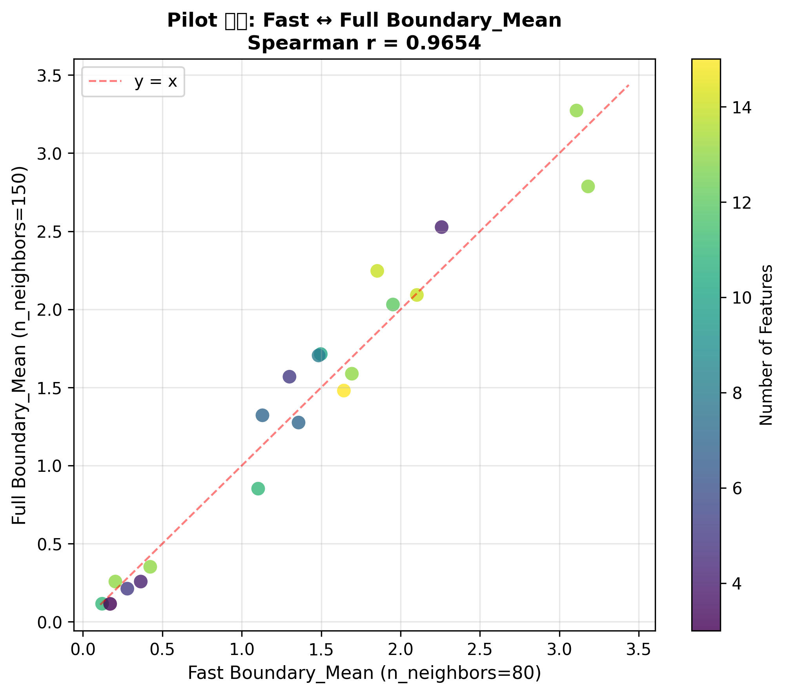
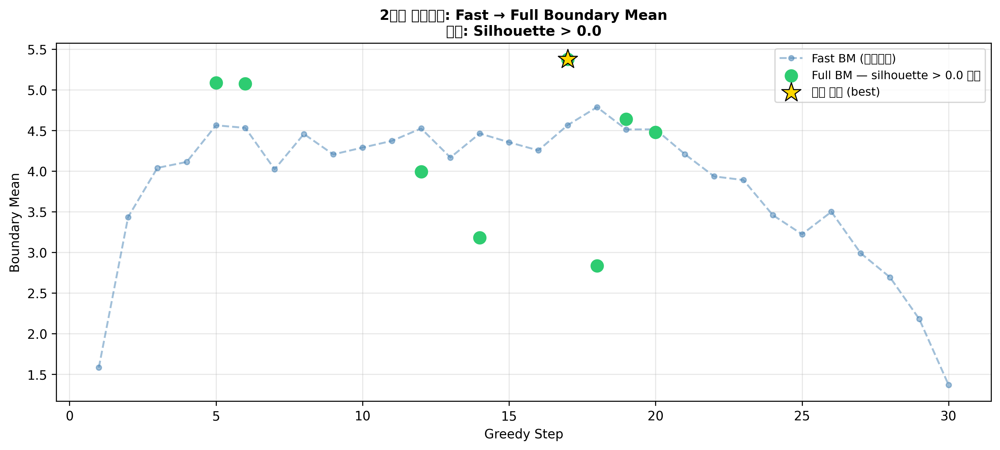
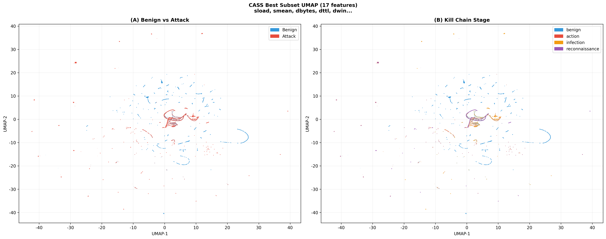
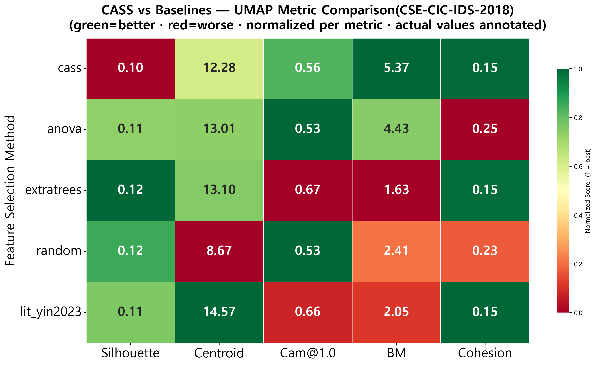

# CASS — Cluster-Aware Feature Selection System


## 개요 (Overview)

**CASS (Cluster-Aware Feature Selection System)** 는 UMAP 기반의 모델 비종속적(model-agnostic) 피처 선택 프레임워크입니다.

### 핵심 가설

> **"저차원 매니폴드 공간(UMAP)에서 공격 트래픽이 정상 트래픽으로 위장하기 어려운(Boundary_Mean 최대화)
> 피처 조합은, 특정 학습 모델에 대한 편향 없이 다양한 ML 탐지 모델에서 높은 성능을 제공한다."**

전통적인 피처 선택(RF 중요도, ANOVA 등)은 특정 모델의 손실 함수나 분포 가정에 의존합니다.
CASS는 **UMAP 공간에서의 Camouflage 최소화(Boundary_Mean 최대화)** 를 평가 기준으로 삼아
어떤 ML 모델에도 bias 없이 일반화되는 피처 부분집합을 탐색합니다.

**목적함수 선택 근거:**
- Silhouette 최대화는 공격 클러스터가 benign 근처에서 "잘 분리된 채로" 위장하는 상황을 허용함
- Boundary_Mean(공격 → nearest benign 평균 거리) 최대화는 위장 자체를 직접 억제함
- 기존 문헌에서 UMAP Camouflage를 피처 선택의 **목적함수**로 사용한 선행 연구 없음 → 새로운 기여
- Silhouette > 0 제약(최소 분리도 보장)으로 클러스터 파편화 방지

---

## 전체 파이프라인 (Pipeline)

```
data/raw/training-flow.csv
         │
         ▼
[Stage 1] 데이터 로드 & UDBB 샘플링
          Benign 60k / Action 20k / Infection 20k / Installation 20k
         │
         ▼
[Stage 2] 전처리
          Inf·NaN → median  |  percentile clipping  |  log1p  |  RobustScaler
         │
         ▼
[Stage 3] Pre-filter
          ExtraTrees 중요도 + ANOVA F-score → 평균 순위 → 상위 K개 선발 (기본 30개)
         │
         ├─ (--pilot) Pilot 검증
         │            무작위 서브셋 20개로 Fast ↔ Full Boundary_Mean 상관 확인
         │            Spearman r ≥ 0.7 이면 Fast BM이 Full BM의 유효한 proxy
         │
         ▼
[Stage 2.7] Reference Camouflage 참고값 계산 (비교용)
            literature baseline 첫 번째 항목(CICIDS2018: umar2024, UNSW-NB15: yin2023)으로
            Full UMAP 실행 → 두 가지 산출물 생성:
              ref_cam      : Camouflage@1.0 수치 → 로그 출력 + reference_camouflage.csv 저장만
                             (연산에 영향 없음, 순수 참고값)
              ref_embedding: UMAP 2D 임베딩 → --analyze 시 Stage 7에서 해당 lit_* 비교군의
                             UMAP 중복 실행을 방지하기 위해 precomputed_embeddings로 전달
         │
         ▼
[Stage 4] 2단계 스크리닝 탐색
          ┌─ 1단계: Fast UMAP (n_neighbors=80) 으로 전체 후보 평가
          │         목적함수: Boundary_Mean 최대화 (silhouette > 0 제약)
          │         --mode greedy  : 전진 선택 (피처 1개씩 추가)
          │         --mode random  : 무작위 서브셋 N개 샘플링
          │
          ├─ Elbow 검출: fast_bm 내림차순 gap → 상위 K 결정
          │
          └─ 2단계: Full UMAP (n_neighbors=150) 으로 상위 K 재평가
                    각 서브셋마다 full_sil + boundary_mean + camouflage 계산
                    (동일 임베딩 재사용 — k-NN 1회 추가)
                    │
                    └─ 최종 선택
                         silhouette > 0 을 만족하는 후보 중
                         boundary_mean 최댓값 → best_features 확정
                         (만족 후보 없으면 제약 완화 → 전체 대상 boundary_mean 최댓값)
         │
         ▼
[Stage 5] 시각화 & 저장
          ┌─ two_phase_screening.png
          │    x축: Greedy Step 전체(원본 순서) / random: Subset ID
          │    파란 선  : 전체 후보의 fast_bm 궤적
          │    초록 점  : top-K 중 full_sil > 0 통과한 서브셋의 full_bm
          │    주황 X   : top-K 중 full_sil ≤ 0 탈락한 서브셋의 full_bm
          │    금색 별  : 최종 선택된 best_subset
          │
          └─ umap_best_subset.png  +  best_subset_umap_embeddings.csv
               best_subset 피처로 Full UMAP 재실행 (Stage 4 임베딩은 저장되지 않으므로)
               (A) Benign vs Attack — 이진 색상
               (B) Kill Chain Stage — 단계별 색상
               임베딩 좌표(UMAP-1, UMAP-2, attack_flag, attack_step) CSV 저장
         │
         ├─ (--export) 비교군 Export             [Stage 6 or 5]
         │             5개 비교군 × train/test CSV
         │             training-flow.csv → train_*.csv
         │             test-flow.csv     → test_*.csv  (동일 scaler)
         │
         └─ (--analyze) UMAP 수치 분석           [Stage 6 or 7]
                        5개 비교군 × 8개 지표 계산
                        → comparison_heatmap.png
```

---

## 논문 증명 전략 (Validation Strategy)

### 비교군 구성

동일 피처 수 **N = len(best_features)** 를 고정하여 차원 혼입(confounding)을 제거합니다.
선택 방법의 차이만 순수하게 비교할 수 있습니다.

| 비교군 | 선택 기준 | 피처 수 | 모델 편향 |
|--------|-----------|---------|-----------|
| `cass` | UMAP Boundary_Mean 최대화 (silhouette > 0 제약) | N (자동) | 없음 ← **제안 방법** |
| `anova` | ANOVA F-score 상위 N개 | N | 선형 분리도 가정 |
| `extratrees` | ExtraTrees 중요도 상위 N개 | N | 트리 구조 편향 |
| `random` | 무작위 N개 | N | — (하한 기준선) |
| `lit_umar2024` | Umar et al. (2024) 논문 수동 선정 | 12 (고정) | 도메인 전문가 편향 |

모든 비교군은 동일한 pre-filter 후보 풀(K개)에서 선택됩니다.

> **[추가 분석: N=12 고정 비교]**
> `lit_umar2024`는 피처 수가 12로 고정되어 있어, N이 다른 비교군과 직접 비교 시
> 피처 수 자체의 효과가 혼입(confounding)될 수 있습니다.
> 이를 통제하기 위해 **CASS가 선택한 피처 조합 중 Boundary_Mean 기준 상위 12개만
> 추출한 결과(`cass_n12`)** 도 실험에 포함합니다.
> 이로써 "피처 수를 12로 동일하게 고정했을 때도 CASS 선택 기준이
> 도메인 전문가 수작업(umar2024)보다 우수한가"를 독립적으로 검증합니다.

### UMAP 수치 지표 8개 (`--analyze`)

비교군별 Full UMAP 실행 후 3그룹 8개 지표를 계산하여 정규화 히트맵으로 시각화합니다.

| 그룹 | 지표 | best 방향 | 의미 |
|------|------|-----------|------|
| **Separability** | Silhouette | ↑ | 클래스 간 분리도 |
| | Centroid_to_Benign | ↑ | 공격-정상 무게중심 거리 |
| | Global_Mean_Dist | ↑ | 공격-정상 전체 평균 거리 |
| **Camouflage** | Camouflage@1.0 | ↓ | benign 근방에 숨은 공격 비율 |
| | Boundary_Mean | ↑ | 공격→nearest benign 평균 거리 |
| **Cluster** | HDBSCAN_Noise_Rate | ↓ | 군집되지 않은 공격 포인트 비율 |
| | Cluster_Count | ↓ | 공격 클러스터 수 (적을수록 응집) |
| | Cohesion_Dist | ↓ | 클러스터 내 평균 분산 거리 |

히트맵은 열별로 0~1 정규화 후 **1 = best** 방향으로 통일하며, 셀에 실제 값을 함께 표기합니다.
CASS 행이 전반적으로 높은 수치를 보이면 **"UMAP 기반 선택이 기하 구조적으로도 우수하다"** 는 논문 주장을 시각적으로 증명합니다.

### ML 교차 비교 (`--export`)

`--export`로 생성된 CSV를 외부 ML 모델(XGBoost, RF, LSTM 등)에 직접 입력합니다.
UMAP이 test 데이터를 보지 않으므로 data leakage가 없습니다.

```
train_*.csv  ←  UDBB 샘플 (120k행, 훈련 데이터 scaler fit)
test_*.csv   ←  test-flow.csv 전체 (동일 scaler transform, 완전 분리)
```

---

## 실험 결과 (Experimental Results — CICIDS2018)

> **실행 환경**: CICIDS2018, UDBB 샘플링 120k행, `--pilot --export --analyze`, greedy mode, top-k=30

### Pilot 검증 — Fast ↔ Full Boundary_Mean 상관


| 항목 | 값 |
|------|----|
| Spearman r | **0.9639** |
| Fast n_neighbors | 80 (재시도 없이 1회 통과) |
| Full n_neighbors | 150 |
| 판정 | ✓ Fast BM이 Full BM의 유효한 proxy (r ≥ 0.7) |

base n_neighbors=80에서 r=0.9639로 기준값(0.7)을 상회하여 재시도 없이 즉시 통과.

---

### 2단계 스크리닝 — Fast → Full Boundary_Mean


Elbow K=8이 결정되어 전체 30 스텝 중 **fast_bm 상위 8개(스텝 10~21)만 Full 재평가**됨.

| Fast 순위 | Step | Fast BM | Full BM | Full 순위 |
|----------|------|---------|---------|----------|
| **1위** | **16** | **8.652** | **8.924** | **→ Full 1위 유지, 최종 선택** |
| 2위 | 21 | 8.459 | 8.137 | Full 3위 |
| 3위 | 13 | 8.395 | 7.630 | Full 7위 |
| 4위 | 12 | 8.363 | 7.773 | Full 5위 |
| 7위 | 14 | 8.209 | 8.642 | Full 2위로 상승 |
| 8위 | 18 | 8.168 | 8.004 | Full 4위로 상승 |

**2단계 스크리닝은 구조적 안전장치**: 이번 실행에서 Fast 1위(step 16)가 Full에서도 1위를 유지했다. 그러나 Fast 순위와 Full 순위가 일치한다는 보장은 없다 — step 14(Fast 7위 → Full 2위), step 13(Fast 3위 → Full 7위)처럼 Fast proxy가 불완전함을 이번 결과도 보여준다. Pilot Spearman r이 1.0이 아닌 한 Fast 순위는 Full 순위의 근사이며, 2단계 Full 재평가는 이 불확실성에 대한 보험으로 유지한다. 계산 비용 측면에서도 Full UMAP은 전체 30 스텝이 아닌 상위 K=8개에만 적용되므로 파이프라인의 병목이 아니다.

---

### CASS 최적 피처 UMAP 시각화 (16 features)


**선택된 16개 피처:**

| 그룹 | 피처 |
|------|------|
| 패킷 크기/길이 (10개) | pkt len mean, pkt size avg, pkt len min, pkt len max, pkt len std, fwd pkt len max, fwd pkt len min, fwd pkt len mean, fwd seg size avg, fwd seg size min |
| 처리율/속도 (2개) | bwd pkts/s, fwd pkts/s |
| IAT (1개) | fwd iat std |
| 기타 (3개) | dst port, protocol, subflow fwd byts |

- **(A) Benign vs Attack**: 공격(적색)이 정상(청색) 공간 전반에 분산 — 실제 NIDS 환경의 위장 패턴 반영
- **(B) Kill Chain Stage**: installation(초록)은 명확히 분리; action·infection은 benign과 혼재 → 단계별 탐지 난이도 차이 시각적 확인

---

### 비교군 UMAP 지표 히트맵


**수치 원본 (comparison_metrics.csv, cass/anova/extratrees/random: N=16, lit_umar2024: N=12 고정):**

| 그룹 | Silhouette↑ | Centroid↑ | Global_Dist↑ | **BM↑** | **Cam@1.0↓** | Noise↓ | Clusters↓ | Cohesion↓ |
|------|------------|-----------|-------------|---------|-------------|--------|-----------|----------|
| **cass** | 0.136 | 9.738 | 26.268 | **8.924** | **0.206** | 0.061 | 249 | 0.481 |
| anova | 0.069 | 2.873 | **38.650** | 2.737 | 0.696 | **0.022** | **57** | **0.238** |
| extratrees | **0.143** | **10.154** | 26.494 | 6.292 | 0.246 | 0.042 | 232 | 0.509 |
| random | 0.163 | 16.151 | 26.958 | 5.239 | 0.460 | 0.071 | 237 | 0.408 |
| lit_umar2024 | 0.112 | 10.616 | 25.839 | 7.124 | 0.258 | 0.044 | 230 | 0.609 |

#### 핵심 결과 해석

**CASS는 핵심 목적함수(Boundary_Mean, Camouflage)에서 명확히 1위:**
- Boundary_Mean: 8.924 → umar2024(7.124) 대비 **+25%**, extratrees(6.292) 대비 **+42%**
- Camouflage@1.0: 0.206 → umar2024(0.258) 대비 공격의 **20% 더 적게 위장** (상대적 감소)

**ANOVA의 역설**: Global_Mean_Dist(38.65), Cluster_Count(57)에서 1위이지만 Boundary_Mean 2.737(꼴찌), Camouflage@1.0 0.696(꼴찌). 공격 클러스터의 **거시적 무게중심**은 benign에서 멀지만, **경계 영역에 침투한 공격 포인트**는 방치함.

**Cluster_Count에 대하여**: CASS는 249로 최대값. CASS는 공격 클러스터의 내부 응집도가 아닌 **benign 경계로부터의 분리**를 최적화하므로, 공격이 넓게 분산되는 것은 설계 특성이며 약점이 아님.

---

### Silhouette 절대값에 관한 해석

CASS의 Silhouette 0.136은 절대 수치가 낮아 보일 수 있다. 이는 CASS의 한계가 아니라 **데이터와 평가 지표의 특성**에서 기인한다.

**Silhouette의 구조적 한계 (NIDS 맥락):**
Silhouette은 *전역적(global)* 클러스터 분리도를 측정한다. 즉, 각 포인트가 동일 클래스 내부와 반대 클래스 전체와의 평균 거리 비교를 기반으로 한다. 그러나 실제 위장 공격(Camouflage Attack)의 위협은 **전역적 분리가 아니라, 공격 트래픽 일부가 benign 경계 근방에 국소적(locally)으로 침투하는 것**이다.

- Silhouette이 높더라도: 공격 클러스터의 일부가 benign 영역 가장자리에 밀착해 있으면 탐지 모델이 misclassify할 수 있다.
- Boundary_Mean은 이 **경계 침투를 직접 측정**한다 — 각 공격 포인트에서 가장 가까운 benign까지의 거리.

두 가지 사례가 이 차이를 실증한다.

첫째, **ANOVA**: Silhouette 0.069(꼴찌)이지만 Cluster_Count 57(1위)로 거시적 분리는 우수 → 그러나 Camouflage@1.0 0.696으로 경계 침투는 최악.

둘째, **extratrees**: Silhouette 0.143으로 5개 비교군 중 **1위**이지만 Boundary_Mean 6.292(3위), Camouflage@1.0 0.246(3위). 전역 분리도가 가장 높은 비교군이 경계 분리에서는 CASS(BM 8.924, Cam 0.206)에 크게 뒤진다. Silhouette이 피처 선택의 유일한 기준이었다면 extratrees를 선택했을 것이다.

반대로 CASS는 Silhouette 0.136(3위)이면서 Boundary_Mean·Camouflage 모두 1위 — 전역 분리도 기준이 아닌 경계 분리도 직접 최적화의 결과다.

> **결론:** 피처 선택의 목적이 "NIDS에서 위장 공격 억제"라면, 전역 분리도(Silhouette)보다 경계 근방 분리도(Boundary_Mean, Camouflage)가 더 적합한 평가 지표다. CASS는 이 지표를 직접 목적함수로 삼았으며, BM·Cam 두 핵심 지표에서 1위를 달성했다.

> Kuppa et al.은 NIDS 이상 탐지에서 *"decision boundaries of nominal and abnormal classes are not very well defined"* 임을 지적하며, 공격자가 benign 경계 근방의 불명확한 영역을 통해 탐지를 우회함을 CSE-CIC-IDS2018 실험으로 실증했다 [Kuppa et al., 2019]. Silhouette은 명확한 클러스터 경계를 가정한 전역 지표이므로 이러한 경계 근방 공격을 포착하지 못하며, Boundary_Mean이 더 적합한 평가 지표임을 지지한다.
>

---

## 실험 결과 (Experimental Results — UNSW-NB15)

> **실행 환경**: UNSW-NB15, UDBB 샘플링 60k행, `--pilot --export --analyze`, greedy mode, top-k=30
>
> **데이터셋 분할**: training-flow.csv (175,341행, 원논문 훈련셋) / test-flow.csv (82,332행, 원논문 테스트셋)
> ※ Kaggle 다운로드 시 파일명이 뒤바뀌어 배포되므로 `unsw_nb15_download.py`의 FILE_MAP에서 training-set↔testing-set 교차 매핑으로 수정

---

### Pilot 검증 — Fast ↔ Full Boundary_Mean 상관



| 항목 | 값 |
|------|----|
| Spearman r | **0.9654** |
| Fast n_neighbors | 80 (재시도 없이 1회 통과) |
| Full n_neighbors | 150 |
| 판정 | ✓ Fast BM이 Full BM의 유효한 proxy (r ≥ 0.7) |

base n_neighbors=80에서 r=0.9654로 기준값(0.7)을 상회하여 재시도 없이 즉시 통과.
CICIDS2018(r=0.9639)과 유사한 수준으로, log1p 전처리 후 피처 스케일이 안정화되어
Fast↔Full 상관이 일관적으로 동작함을 확인.

---

### 2단계 스크리닝 — Fast → Full Boundary_Mean



Elbow K=8이 결정되어 전체 greedy 스텝 중 **fast_bm 상위 8개(step 5·6·12·14·17·18·19·20)만 Full 재평가**됨.

| Fast 순위 | Step | Fast BM | Full BM | Full 순위 |
|----------|------|---------|---------|----------|
| **1위** | **18** | **4.786** | 2.834 | **→ Full 꼴찌 (8위)** |
| 2위 | 17 | 4.564 | **5.373** | **→ Full 1위, 최종 선택** |
| 3위 | 5 | 4.562 | 5.086 | Full 2위 |
| 4위 | 6 | 4.531 | 5.073 | Full 3위 |
| 5위 | 12 | 4.523 | 3.990 | Full 6위 |
| 6위 | 20 | 4.513 | 4.477 | Full 5위 |
| 7위 | 19 | 4.511 | 4.637 | Full 4위 |
| 8위 | 14 | 4.462 | 3.180 | Full 7위 |

**이번 결과는 2단계 스크리닝의 필요성을 가장 강하게 실증한 사례다**: Fast 1위(step 18)가 Full 재평가에서 꼴찌(8위)로 역전되고, Fast 2위(step 17)가 Full 1위를 차지했다. CICIDS2018에서는 Fast 1위가 Full에서도 1위를 유지했으나, 이번 결과는 Fast proxy가 최적 서브셋을 잘못 식별할 수 있음을 명확히 보여준다. Pilot Spearman r이 1.0이 아닌 한 Fast 순위는 Full 순위의 근사이며, 2단계 Full 재평가는 이 불확실성에 대한 구조적 안전장치다.

---

### CASS 최적 피처 UMAP 시각화 (17 features)



**선택된 17개 피처:**

| 그룹 | 피처 |
|------|------|
| 트래픽 부하/바이트 (4개) | sload, sbytes, dbytes, smean |
| 윈도우/TTL (3개) | dttl, swin, dwin |
| 패킷 수/손실 (3개) | spkts, dloss, sloss |
| Jitter (2개) | sjit, djit |
| TCP/연결 상태 (4개) | dtcpb, synack, is_sm_ips_ports, ct_state_ttl |
| TTL 컨텍스트 (1개) | sttl |

log1p 전처리 적용으로 skewed 트래픽 피처(bytes, jitter 등)의 분포가 정상화되면서
각 피처가 독립적인 정보량을 갖게 되어 CICIDS2018(16개)와 유사한 수준의 피처 수가 선택됨.

- **(A) Benign vs Attack**: 공격(적색)이 정상(청색) 공간 중앙부에 밀집된 구조 — benign 경계 근방 위장 패턴 반영
- **(B) Kill Chain Stage**: reconnaissance(보라)가 상단에 집중; action·infection은 benign 근방에 일부 산재 → 단계별 탐지 난이도 차이 시각적 확인

---

### 비교군 UMAP 지표 히트맵



**수치 원본 (comparison_metrics.csv, cass/anova/extratrees/random: N=17, lit_yin2023: N=20 고정):**

| 그룹 | Silhouette↑ | Centroid↑ | Global_Dist↑ | **BM↑** | **Cam@1.0↓** | Noise↓ | Clusters↓ | Cohesion↓ |
|------|------------|-----------|-------------|---------|-------------|--------|-----------|----------|
| **cass** | 0.097 | 12.278 | **29.268** | **5.373** | 0.557 | 0.073 | **127** | **0.146** |
| anova | 0.113 | 13.008 | 27.377 | 4.433 | **0.533** | **0.059** | 152 | 0.246 |
| extratrees | **0.119** | 13.098 | 25.130 | 1.632 | 0.672 | 0.100 | 205 | 0.147 |
| random | 0.116 | 8.668 | 23.191 | 2.413 | **0.533** | 0.158 | 192 | 0.229 |
| lit_yin2023 | 0.114 | **14.565** | 26.526 | 2.046 | 0.662 | 0.163 | 170 | 0.147 |

#### 핵심 결과 해석

**CASS는 핵심 목적함수(Boundary_Mean)에서 명확히 1위:**
- Boundary_Mean: **5.373** → anova(4.433) 대비 **+21%**, yin2023(2.046) 대비 **+163%**, extratrees(1.632) 대비 **+229%**
- Global_Mean_Dist: **29.268** (5개 비교군 중 1위) — 목적함수 BM 최적화가 거시적 분리도도 함께 향상

**Camouflage@1.0에 대하여**: CASS 0.557로 anova(0.533)·random(0.533)에 이어 3위.
BM(평균 경계 거리)을 직접 최적화하는 CASS는 분포의 평균을 끌어올리지만,
임계값 t=1.0 이내 비율(Cam@1.0)은 경계 근방 소수 포인트의 분포에 민감하게 반응한다.
anova·random의 Cam이 낮은 이유는 해당 피처 조합이 경계 근방 포인트를 우연히 적게 만들어내는 구조이며,
BM 2위(4.433)·3위(2.413)에 그친다는 점에서 전반적인 경계 분리 품질은 CASS에 미치지 못한다.

**"Random 역설" (CICIDS2018의 ANOVA 역설과 구조 동일):**
random이 Cam@1.0 0.533으로 공동 1위이지만 BM=2.413(3위). 무작위 피처는 경계 근방 일부 포인트를 분리하더라도 전반적인 공격-정상 경계 거리를 보장하지 못한다. 두 데이터셋에 걸쳐 **"임계값 기반 Cam ≠ 경계 분리 품질"** 이 재현됨.

**lit_yin2023 (20 수치형 피처):**
CASS N=17 대비 3개 더 많은 피처를 사용하면서도 BM=2.046(4위)으로 크게 뒤짐.
도메인 전문가 수작업(IGRF-RFE 기반)으로도 UMAP 경계 분리 관점에서는 CASS의 자동 탐색에 미치지 못함을 실증.

**Cluster_Count에 대하여**: CASS의 127은 5개 비교군 중 최소. BM 최적화가 공격을 benign에서 밀어내는 과정에서 방향이 정렬되어 오히려 클러스터 응집이 개선됨. CICIDS2018(CASS 249로 최대)과 반대 양상으로, 데이터셋 고유의 공격 매니폴드 구조 차이로 해석됨.

---

## Ablation Study

CASS 파이프라인의 주요 설계 결정 각각이 실제로 성능에 기여하는지 검증합니다.

---

### 1. 2단계 스크리닝 — Fast Proxy의 한계와 Full 재평가의 필요성

Fast UMAP(n_neighbors=80)의 BM 순위만으로 최종 서브셋을 선택할 경우, Full BM 순위와의 불일치로 열등한 서브셋이 선택될 수 있다. 이를 두 데이터셋에서 실증한다.

**UNSW-NB15 — Fast 1위가 Full 꼴찌로 역전 (Elbow K=8):**

| Fast 순위 | Step | Fast BM | Full BM | Full 순위 |
|----------|------|---------|---------|----------|
| **1위** | **18** | **4.786** | 2.834 | **꼴찌 (8위)** |
| 2위 | 17 | 4.564 | **5.373** | **1위 → 최종 선택** |
| 3위 | 5 | 4.562 | 5.086 | 2위 |
| 4위 | 6 | 4.531 | 5.073 | 3위 |

Fast-only 선택 시 BM=2.834, 2단계 Full 재평가 후 BM=5.373: **+89% 향상**.

**CICIDS2018 — Fast 1위가 Full 1위 유지 (Elbow K=8):**

| Fast 순위 | Step | Fast BM | Full BM | Full 순위 |
|----------|------|---------|---------|----------|
| **1위** | **16** | **8.652** | **8.924** | **1위 → 최종 선택** |
| 2위 | 21 | 8.459 | 8.137 | 3위 |
| 7위 | 14 | 8.209 | 8.642 | 2위로 상승 |
| 3위 | 13 | 8.395 | 7.630 | 7위로 하락 |

CICIDS2018에서는 Fast 1위가 Full에서도 1위를 유지했으나, Fast 3위→Full 7위, Fast 7위→Full 2위처럼 내부 순위는 역전되었다.

두 데이터셋에 걸쳐 Pilot Spearman r이 0.96 수준이어도 개별 서브셋의 Fast↔Full 순위가 역전될 수 있음이 실증되었다. Fast proxy는 탐색 공간을 효율적으로 축소하는 도구이며, Full 재평가는 이 불확실성을 보정하는 구조적 안전장치다.

---

### 2. Pre-filter — 탐색 공간 절감과 후보 품질 보장

Greedy 탐색에서 피처 F개 전체를 대상으로 하면 Fast UMAP 실행 횟수는 F(F+1)/2로 증가한다.

| 데이터셋 | 전체 피처 (F) | Pre-filter 후 (K) | Fast 실행 (필터 없음) | Fast 실행 (필터 후) | 절감 배수 |
|---------|------------|-----------------|-------------------|-----------------|---------|
| CICIDS2018 | 76 | 30 | 2,926회 | 465회 | **6.3×** |
| UNSW-NB15 | 39 | 30 | 780회 | 465회 | **1.7×** |

탐색 비용 절감 외에, ExtraTrees + ANOVA 평균 순위 결합은 두 기법의 편향(트리 구조 편향, 선형 분리도 가정)을 상호보완하여 통계적으로 무의미한 피처를 사전 제거한다. 또한 모든 비교군(anova, extratrees, random)이 동일한 pre-filter 후보 풀에서 출발하므로, 실험이 피처 공간의 차이 없이 **선택 기준 자체의 차이**만을 순수하게 비교한다.

---

### 3. Silhouette > 0 제약 — 수학적 정당화와 경험적 관찰

**수학적 정당화:**

Silhouette > 0의 임계값 0.0은 임의적으로 선택된 값이 아니라 수식에서 자연스럽게 도출되는 경계값이다.

```
s(i) = (b(i) - a(i)) / max(a(i), b(i))

  s(i) > 0  →  b(i) > a(i)  →  포인트 i가 반대 클래스보다 자기 클래스에 더 가까움
  s(i) < 0  →  b(i) < a(i)  →  포인트 i가 자기 클래스보다 반대 클래스에 더 가까움
```

Mean Silhouette > 0은 "attack 포인트들이 평균적으로 benign보다 자기들끼리 더 가깝다"는 최소한의 구조적 조건이며, 이 경계 아래에서는 BM 최적화 자체가 무의미해진다.

**Silhouette > 0과 BM의 역할 분리:**

Mean Silhouette > 0은 전체 클러스터 구조가 붕괴되지 않는다는 보장이지, 개별 공격 포인트의 위장을 막는 조건이 아니다. 평균이 양수이더라도 일부 개별 포인트는 s(i) < 0일 수 있으며 — 이 포인트들이 바로 benign 경계 근방에 숨어드는 camouflage 포인트다. Boundary_Mean이 이를 직접 측정하고 최적화한다.

| 역할 | 담당 |
|------|------|
| 최소 구조 보장 (degenerate embedding 방지) | Silhouette > 0 |
| 개별 camouflage 포인트 억제 | Boundary_Mean 최대화 |

**경험적 관찰:**

두 데이터셋(CICIDS2018, UNSW-NB15) 모두에서 Full 재평가된 상위 K개 서브셋 전원이 Silhouette > 0 제약을 통과했다 — 제약이 실제로 발동하지 않았다. 이는 제약이 불필요하다는 의미가 아니라, pre-filter + greedy 탐색 조합이 이미 최소 구조를 보장하는 서브셋으로 수렴함을 보여준다. Silhouette > 0은 degenerate 피처 조합에서도 BM 최적화가 의미있는 기하 공간에서 이루어지도록 보장하는 안전장치다.

---

## 프로젝트 구조 (Directory Structure)

```
CASS/
├── data/
│   ├── raw/
│   │   ├── cicids2018/
│   │   │   ├── training-flow.csv      # CICIDS2018 훈련 원본 (76 피처 + 레이블)
│   │   │   ├── test-flow.csv          # CICIDS2018 테스트 원본 (완전 분리 보관)
│   │   │   └── cicids2018_download.py # Kaggle 다운로드 & 변환 스크립트
│   │   └── unsw_nb15/
│   │       ├── training-flow.csv      # UNSW-NB15 훈련 원본 (42 피처 + 레이블)
│   │       ├── test-flow.csv          # UNSW-NB15 테스트 원본 (완전 분리 보관)
│   │       └── unsw_nb15_download.py  # Kaggle 다운로드 & 변환 스크립트
│   └── processed/
│       └── cicids2018_processed.csv   # 전처리 완료 (자동 생성)
├── src/
│   ├── config.py        # 전역 설정 — UMAP 파라미터, 경로, 샘플링 수, 데이터셋별 설정
│   ├── data_loader.py   # 로드 + UDBB 샘플링 + 전처리 파이프라인
│   ├── pre_filter.py    # ExtraTrees + ANOVA 평균 순위 기반 사전 필터링
│   ├── evaluator.py     # UMAP 차원 축소 + Silhouette Score (cuML GPU)
│   ├── search_algo.py   # 2단계 스크리닝 (Greedy/Random + Elbow + Full 재평가)
│   ├── exporter.py      # 비교군 구성 + train/test CSV 생성
│   └── analyzer.py      # 비교군별 8개 UMAP 지표 계산 + 히트맵
├── notebooks/
│   ├── 01_eda_and_preprocessing.ipynb
│   └── 02_silhouette_analysis.ipynb
├── results/             # 모든 출력 자동 저장 (gitignore 처리)
│   ├── cicids2018/      # CICIDS2018 실험 결과
│   │   ├── figures/
│   │   ├── logs/
│   │   └── exports/
│   └── unsw_nb15/       # UNSW-NB15 실험 결과
│       ├── figures/
│       ├── logs/
│       └── exports/
├── main.py              # CLI 진입점
├── make_test_exports.py # 로컬 test CSV 생성 스크립트 (대용량 파일 청크 처리)
└── requirements.txt
```

UNSW-NB15 원본 데이터는 CASS 내부 경로에서 참조합니다:

```
data/raw/unsw_nb15/
├── training-flow.csv         # UNSW-NB15 훈련 원본 (42 피처 + 레이블, 175k행)
├── test-flow.csv             # UNSW-NB15 테스트 원본 (완전 분리 보관, 82k행)
└── unsw_nb15_download.py     # Kaggle 다운로드 & 변환 스크립트
```

`unsw_nb15_download.py`를 `data/raw/unsw_nb15/` 에서 실행하면 Kaggle(`mrwellsdavid/unsw-nb15`)에서 자동으로 다운로드 및 변환됩니다.

---

## 실행 가이드 (Execution Guide)

### 1단계 — 환경 설정

```bash
# cuML (RAPIDS) — GPU UMAP 필수
conda install -c rapidsai -c conda-forge cuml=26.2.0 python=3.10 cudatoolkit=12.x

# 나머지 의존성
pip install -r requirements.txt
```

### 2단계 — 데이터 준비

**CICIDS2018**
```
data/raw/cicids2018/training-flow.csv   # 컬럼: 피처 76개 + attack_flag + attack_step
data/raw/cicids2018/test-flow.csv       # 동일 컬럼 구조
```
`attack_step`: `benign` · `action` · `infection` · `installation`

데이터가 없는 경우 `data/raw/cicids2018/cicids2018_download.py`를 실행하면 Kaggle에서 자동 다운로드됩니다.

**UNSW-NB15**
```
data/raw/unsw_nb15/training-flow.csv   # 피처 39개(수치형) + attack_flag + attack_step
data/raw/unsw_nb15/test-flow.csv       # 동일 컬럼 구조
```
`attack_step`: `benign` · `action` · `infection` · `reconnaissance`
(`lateral-movement`, `installation` 제외 — 소수 샘플 및 PCA leakage 확인)

데이터가 없는 경우 `data/raw/unsw_nb15/unsw_nb15_download.py`를 실행하면 Kaggle(`mrwellsdavid/unsw-nb15`)에서 자동 다운로드됩니다.

`attack_flag`: 0 = benign, 1 = attack (공통)

### 3단계 — 파이프라인 실행

목적에 따라 플래그를 조합합니다.

```bash
# ── CICIDS2018 (기본값) ──────────────────────────────────────
python main.py --pilot --export --analyze

# ── UNSW-NB15 ───────────────────────────────────────────────
python main.py --dataset unsw_nb15 --pilot --export --analyze

# ── 탐색 방식 변경 ──────────────────────────────────────────
python main.py --dataset unsw_nb15 --mode random --n-subsets 100
python main.py --dataset unsw_nb15 --top-k 15

# ── 개별 플래그 ─────────────────────────────────────────────
python main.py --dataset unsw_nb15 --pilot    # Fast↔Full 상관 사전 확인
python main.py --dataset unsw_nb15 --export   # 비교군 train/test CSV
python main.py --dataset unsw_nb15 --analyze  # 8지표 히트맵
```

### CLI 플래그 전체 목록

| 플래그 | 기본값 | 설명 |
|--------|--------|------|
| `--dataset` | `cicids2018` | 데이터셋 선택 (`cicids2018` / `unsw_nb15`) |
| `--mode` | `greedy` | 탐색 방식 (`greedy` / `random`) |
| `--top-k` | `30` | Pre-filter 후 유지할 피처 수 |
| `--n-subsets` | `80` | random 모드 평가 서브셋 수 |
| `--pilot` | off | Fast↔Full Boundary_Mean 상관 사전 검증 |
| `--export` | off | 비교군별 train/test CSV 저장 |
| `--analyze` | off | 비교군별 8지표 계산 + 히트맵 저장 |

### 4단계 — 출력 결과 확인

결과는 데이터셋별로 분리된 디렉토리에 저장됩니다.

```
results/
├── cicids2018/          # --dataset cicids2018 결과
│   ├── figures/
│   │   ├── umap_best_subset.png            # CASS 최적 피처 UMAP 시각화
│   │   ├── two_phase_screening.png         # Fast vs Full BM 비교
│   │   ├── pilot_fast_vs_full.png          # (--pilot) Pilot 검증 산점도
│   │   ├── best_subset_umap_embeddings.csv
│   │   └── comparison_heatmap.png          # (--analyze) 비교군 × 8지표 히트맵
│   ├── logs/
│   │   ├── pre_filter_ranking.csv
│   │   ├── search_results_greedy.csv
│   │   ├── pilot_validation.csv
│   │   └── comparison_metrics.csv
│   └── exports/                            # (--export) ML 학습용 CSV
│       ├── train_cass.csv / test_cass.csv
│       ├── train_anova.csv / test_anova.csv
│       ├── train_extratrees.csv / test_extratrees.csv
│       ├── train_random.csv / test_random.csv
│       └── train_lit_umar2024.csv / test_lit_umar2024.csv
└── unsw_nb15/           # --dataset unsw_nb15 결과 (동일 구조)
    ├── figures/
    ├── logs/
    └── exports/
```

---

## 알고리즘 상세 (Algorithm Details)

### 전처리 파이프라인

`data_loader.py`의 `preprocess()` 함수가 실행하는 4단계 파이프라인입니다.

```
① Inf / NaN → 열별 중앙값(median) 대체
   (inf, -inf, -1 모두 NaN 처리 후 열별 median으로 imputation)

② Percentile Clipping (이상치 제거)
   - log 변환 대상 피처 (skewed): clip(lower=0, upper=0.99분위)
   - 나머지 피처:                  clip(lower=0.01분위, upper=0.99분위)

③ log1p 변환 (log 피처만 적용)
   X[col] = log(1 + X[col])   — 0-safe, 음수 불가

④ RobustScaler 정규화
   X_scaled = (X - median) / IQR   (중앙값 기준, 이상치 내성)
```

**log1p 적용 피처 목록 (49개, `LOG_FEATURES`):**

| 그룹 | 피처 |
|------|------|
| 패킷 수/바이트 | tot fwd/bwd pkts · totlen fwd/bwd pkts |
| 패킷 길이 | fwd pkt len max/min/mean/std · bwd pkt len max/min/mean/std |
| | pkt len min/max/mean/std/var · pkt size avg · fwd/bwd seg size avg |
| 처리율 | flow byts/s · flow pkts/s · fwd/bwd pkts/s |
| IAT | flow iat mean/std/max · fwd iat tot/mean/std/max · bwd iat tot/mean/std/max |
| 헤더/윈도우 | fwd/bwd header len · init fwd/bwd win byts |
| 서브플로우 | subflow fwd/bwd pkts · subflow fwd/bwd byts |
| Active/Idle | active mean/std/max · idle mean/std/max |

---

### Pre-filter 결합 공식

ExtraTrees 중요도 순위 `r_tree(f)` 와 ANOVA F-점수 순위 `r_anova(f)` 를 단순 평균 순위로 결합합니다.

```
avg_rank(f) = ( r_tree(f) + r_anova(f) ) / 2

  r_*(f) : 해당 지표 내림차순 정렬 시 피처 f의 0-based 순위
           (중요도·F-score가 가장 높은 피처 = 0)

상위 K = TOP_K_PREFILTER(기본 30)개를 avg_rank 오름차순으로 선발
```

두 방법을 동등하게 결합하여 트리 구조 편향(ExtraTrees)과 선형 분리도 가정(ANOVA)을 상호 보완합니다.

---

### 최적 서브셋 선택 (Boundary_Mean Maximization)

CASS의 핵심 기여는 **"UMAP 공간에서 Camouflage가 낮은(Boundary_Mean이 높은) 피처 조합이 ML 탐지 성능도 높다"** 는 주장입니다. Boundary_Mean을 직접 목적함수로 삼아 공격 트래픽의 위장을 억제하는 피처 조합을 탐색합니다.

#### 선택 절차

```
Step 1 — 1단계 Fast 스크리닝
  각 후보 서브셋에 Fast UMAP 적용
  → silhouette > MIN_SILHOUETTE(0.0) 를 만족하는 경우에만
    Boundary_Mean 계산 → 최댓값 기준으로 탐색 방향 결정

  [greedy 탐색 방식]
  매 step마다 "지금까지 선택된 피처들 + 후보 1개" 조합을 전부 시험하고,
  BM이 가장 높은 1개만 추가. 한 번 선택된 피처는 되돌리지 않음.

  후보 K=30개 기준 Fast UMAP 실행 횟수:
    step 1: 30회  (1개짜리 서브셋 30개)
    step 2: 29회  (선택된 1개 제외 나머지 29개)
    step 3: 28회
    ...
    step 30:  1회
    총 = 30 + 29 + ... + 1 = 465회

  결과로 fast_df 에 30행(step 1~30) 누적.
  완전 탐색(2^30 ≈ 10억)의 근사이므로 전역 최적을 보장하지 않음.
  → 이를 보완하기 위해 --mode random 또는 2단계 Full 재평가 활용.

  [Step-level fallback — greedy 전용]
  특정 step에서 모든 후보 피처가 silhouette ≤ 0 이면,
  그 step에 한해 silhouette 제약을 완화하고 Boundary_Mean만으로 다음 피처 선택.
  다음 step에서는 제약이 다시 적용됨.

Step 2 — Elbow 검출
  fast_bm 내림차순 gap 분석 → 상위 K 결정

Step 3 — 2단계 Full 재평가
  상위 K개 서브셋에 Full UMAP 적용
  → full_sil + boundary_mean + camouflage 동시 계산

  [중요] K는 Full 재평가할 "서브셋 개수"이지 "선택될 피처 수"가 아님.
  greedy의 각 step 서브셋은 크기가 모두 다름:
    step 3  서브셋 → 피처  3개짜리
    step 12 서브셋 → 피처 12개짜리
    step 20 서브셋 → 피처 20개짜리
  K=8이면 이 서브셋들 중 fast_bm 상위 8개를 Full로 재평가하는 것.
  최종 선택될 피처 수는 어느 서브셋이 Full BM 1위를 차지하느냐에 따라 결정되며,
  데이터셋마다 다름 (CICIDS2018: 12개, UNSW-NB15: 4개).

Step 4 — 최종 선택
  survived = { subset : full_sil > MIN_SILHOUETTE }
  best = argmax boundary_mean  over survived

  [Final-selection fallback]
  top-K 전체를 Full 재평가한 뒤에도 silhouette > 0 을 만족하는 서브셋이
  단 하나도 없으면, 제약을 완화하여 top-K 전체 대상 boundary_mean 최댓값으로 선택.
  Step-level fallback(greedy 탐색 중 단계별 제약 완화)과는 별개로 동작함.
```

#### 수식

```
best_features = argmax  Boundary_Mean(UMAP_full(X[S]))
                S ∈ TopK
                subject to  Silhouette(UMAP_full(X[S])) > MIN_SILHOUETTE(0.0)
```

#### 논문 방어 논리

> *"We select the feature subset that maximizes the mean distance from attack points
> to their nearest benign neighbor in UMAP space (Boundary_Mean), subject to a minimum
> separability constraint (Silhouette > 0). This directly minimizes the camouflage rate
> without relying on any externally tuned threshold, as Silhouette > 0 is a
> model-free, parameter-free condition meaning attack clusters are closer to each other
> than to benign clusters."*

- **하이퍼파라미터 없음**: Boundary_Mean은 직접 최대화, Silhouette > 0은 고정된 수학적 조건 (튜닝 불필요)
- **선행 연구와의 차별점**: 기존 연구는 camouflage를 측정 지표로만 활용; CASS는 이를 **탐색 목적함수**로 직접 사용
- **파편화 방지**: Silhouette > 0 제약으로 클러스터 구조가 degenerate 상태로 붕괴되는 것을 방지
- **Silhouette > 0과 BM의 역할 분리**: 제약은 최소 구조를 보장하고, BM이 개별 camouflage 포인트를 억제한다 → [Ablation Study 참조](#ablation-study)

---

### Elbow 검출 알고리즘

`search_algo.py`의 `find_elbow()` 함수입니다. Fast Boundary_Mean 점수의 내림차순 정렬 후 다음 조건으로 Elbow K를 결정합니다.

```
scores_desc = [s_1 ≥ s_2 ≥ ... ≥ s_n]  (Fast Boundary_Mean 내림차순)

gaps[i] = |s_i - s_{i+1}|               (인접 점수 차이, i = 1..n-1)
max_gap  = max(gaps)
threshold = max_gap × ELBOW_GAP_RATIO   (기본 0.1)

K = 첫 번째 i where gaps[i] < threshold  (0-based: K = i+1)
K = max(K, ELBOW_MIN_K)                 (최소 8 보장)
K = n  if 조건 미발생                   (모두 Full 재평가)
```

**직관:** Boundary_Mean 점수가 급격히 떨어지기 시작하는 "절벽" 직전 지점을 Elbow로 보고, 그 위의 서브셋만 Full UMAP으로 재평가합니다.

---

### Silhouette Score 서브샘플링

Silhouette는 O(n²) 연산이므로, 10,000개 초과 시 무작위 서브샘플로 근사합니다.

```python
# evaluator.py / analyzer.py 공통 적용
if n > 10_000:
    idx = rng.choice(n, 10_000, replace=False)
    sil = silhouette_score(emb[idx], y[idx], metric="euclidean")
```

---

### 비교군 구성 로직 (`exporter.py`)

N = `len(best_features)` 로 모든 비교군의 피처 수를 동일하게 고정합니다.

| 비교군 | 선택 방법 | 소스 풀 |
|--------|-----------|---------|
| `cass` | UMAP Boundary_Mean 최적화 결과 | — |
| `anova` | `filter_summary`를 ANOVA_F 내림차순 재정렬 → 상위 N개 | Pre-filter 풀 (K개) |
| `extratrees` | `filter_summary`를 Tree_Importance 내림차순 재정렬 → 상위 N개 | Pre-filter 풀 (K개) |
| `random` | `random.sample(candidate_pool, N)` — seed=RANDOM_SEED+1000 | Pre-filter 풀 (K개) |
| `lit_<name>` | `LITERATURE_BASELINES[name]` 수동 정의 (데이터셋 내 존재하는 것만) | 전체 피처 |

> **중요:** anova / extratrees 비교군은 **Pre-filter 후보 풀(K개) 내에서** 재정렬하여 선택합니다. 전체 피처 중 상위 N개가 아닙니다. 동일한 후보 풀 안에서 선택 기준만 달리하여 순수 비교를 보장합니다.

> **[설계 정당화 — Pre-filter 후보 풀 공유]**
> Pre-filter 자체가 ExtraTrees와 ANOVA로 구성되어 있고, `anova`·`extratrees` 비교군도
> 동일한 두 기법을 기반으로 선택되므로 순환 참조처럼 보일 수 있습니다.
> 그러나 이는 의도된 설계입니다.
>
> Pre-filter의 역할은 전체 피처 공간에서 **통계적으로 무의미한 피처를 제거하는 전처리**이며,
> 비교군 선택은 이 걸러진 후보 풀 안에서 **선택 기준의 차이**만을 순수하게 비교하는 단계입니다.
> 모든 비교군이 동일한 후보 풀에서 출발하기 때문에, 피처 공간의 차이 없이
> "어떤 선택 기준이 더 나은 피처 조합을 찾는가"라는 질문에 집중할 수 있습니다.
>
> 이 설계는 *"CASS가 동일한 출발점에서 다른 통계적 방법보다 우수한 피처 조합을 탐색한다"*
> 는 주장을 더 공정하게 검증하며, ANOVA·ExtraTrees 비교군의 성능이 높게 나오더라도
> 이는 Pre-filter의 효과가 아닌 **선택 기준 자체의 우위**로 해석됩니다.

---

### 8개 수치 지표 계산 공식

`analyzer.py`의 `_compute_metrics(emb, y)` — UMAP 2D 임베딩에서 계산합니다.

#### [Separability 그룹]

**① Silhouette Score**
```
s(i) = (b(i) - a(i)) / max(a(i), b(i))

  a(i) : 포인트 i와 동일 클래스 내 나머지 포인트들의 평균 유클리드 거리
  b(i) : 포인트 i와 반대 클래스 포인트들의 평균 유클리드 거리

Silhouette = mean( s(i) for all i )   ∈ [-1, 1]
```

**② Centroid_to_Benign**
```
c_B = mean(emb[y == 0], axis=0)   # benign 무게중심
c_A = mean(emb[y == 1], axis=0)   # attack 무게중심

Centroid_to_Benign = ||c_A - c_B||_2
```
두 클래스 무게중심 간 유클리드 거리. 클러스터가 멀리 분리될수록 큰 값.

**③ Global_Mean_Dist**
```
A_sub ⊆ attack_pts  (최대 5,000개 서브샘플)
B_sub ⊆ benign_pts  (최대 5,000개 서브샘플)

Global_Mean_Dist = mean( ||a - b||_2  for all a ∈ A_sub, b ∈ B_sub )
```
공격-정상 간 쌍별(pairwise) 거리의 전체 평균. 메모리 제어를 위해 서브샘플.

---

#### [Camouflage 그룹]

**④ Boundary_Mean**
```
NearestNeighbors(n_neighbors=1).fit(benign_pts)
nn_dists[i] = min( ||attack_pts[i] - b||_2  for b ∈ benign_pts )

Boundary_Mean = mean(nn_dists)
```
각 공격 포인트에서 가장 가까운 정상 포인트까지의 거리 평균. 클수록 공격이 정상 영역에서 멀리 분리됨.

**⑤ Camouflage@t**
```
Camouflage@t = mean( nn_dists[i] ≤ t )   (비율, 0~1)
```
benign 근방 반경 t 이내에 위치한 공격 포인트 비율. 작을수록 위장 공격이 적음.
기본값: t = 1.0 (`CAMOUFLAGE_THRESHOLDS = [1.0]`).

---

#### [Cluster 그룹]

공격 포인트만 대상으로 `HDBSCAN(min_cluster_size=50, min_samples=10)` 실행.

**⑥ HDBSCAN_Noise_Rate**
```
labels = HDBSCAN.fit_predict(attack_pts)
HDBSCAN_Noise_Rate = mean( labels == -1 )
```
어느 클러스터에도 할당되지 않은 noise 공격 포인트 비율. 작을수록 공격이 응집되어 있음.

**⑦ Cluster_Count**
```
Cluster_Count = len( unique(labels[labels != -1]) )
```
발견된 유효 공격 클러스터 수. 작을수록 공격 패턴이 단일한 덩어리로 응집.

**⑧ Cohesion_Dist**
```
For each cluster c:
  centroid_c = mean(attack_pts[labels == c], axis=0)
  intra_c = sum( ||p - centroid_c||_2  for p in attack_pts[labels == c] )

Cohesion_Dist = sum(intra_c for all c) / n_valid_attack_pts
```
클러스터 내 포인트들의 무게중심 기준 평균 거리(분산 거리). 작을수록 클러스터가 조밀.

---

### 히트맵 정규화 방식

```
raw_val → norm = (raw - col_min) / (col_max - col_min)   # 0~1

higher_better = True  → 히트맵 값 = norm         (큰 raw가 진한 초록)
higher_better = False → 히트맵 값 = 1 - norm      (작은 raw가 진한 초록)
```

모든 열에서 1.0(진한 초록) = best 방향으로 통일. 셀 annotation은 정규화 전 실제 값 표시.

---

## 핵심 설계 결정 (Key Design Decisions)

### UMAP 파라미터 (NetFlowGap 기준)

| 구분 | n_neighbors | min_dist | metric | init | 용도 |
|------|------------|---------|--------|------|------|
| **Full** | 150 | 0.01 | manhattan | spectral | 논문 보고용, 최종 평가 |
| **Fast** | 80 | 0.05 | manhattan | spectral | 1단계 스크리닝 전용 |

Fast 파라미터는 내부 스크리닝에만 사용되며 논문에 직접 보고되지 않습니다.
Full(150)과의 임베딩 구조 간극을 줄이기 위해 n_neighbors=80, min_dist=0.05, init='spectral'로 설정합니다.

### UDBB 샘플링

Uniform Distribution Based Balancing (Abdulhammed et al., 2019):

**CICIDS2018**

| 클래스 | 샘플 수 | 비율 |
|--------|--------|------|
| Benign | 60,000 | 50% |
| Action (C2) | 20,000 | 16.7% |
| Infection | 20,000 | 16.7% |
| Installation | 20,000 | 16.7% |

**UNSW-NB15**

| 클래스 | 샘플 수 | 비율 |
|--------|--------|------|
| Benign | 30,000 | 50% |
| Action | 10,000 | 16.7% |
| Infection | 10,000 | 16.7% |
| Reconnaissance | 10,000 | 16.7% |

`lateral-movement`(2,000행)와 `installation`(1,746행)은 샘플 수 부족 및 탐색적 분석(PCA)에서 확인된 feature-level distributional overlap으로 인해 제외.

### 2단계 스크리닝 & Elbow 검출 & 최종 선택

UMAP 연산 비용 절감을 위해 2단계 구조를 사용합니다.

1. **Reference 참고값**: umar2024 피처로 Full UMAP 실행 → Camouflage@1.0 실측값 저장 (비교용, 제약 아님)
2. **1단계 (Fast)**: 전체 후보 조합을 빠르게 평가 → Boundary_Mean 계산 (silhouette > 0 제약)
3. **Elbow 검출**: 내림차순 fast_bm에서 gap < `max_gap × ELBOW_GAP_RATIO` 인 지점 → 상위 K 결정
4. **2단계 (Full)**: 상위 K개에 대해서만 논문 파라미터로 재평가 → Silhouette + Boundary_Mean + Camouflage 동시 계산 (동일 임베딩 재사용)
5. **최종 선택**: `silhouette > MIN_SILHOUETTE` 를 만족하는 후보 중 Boundary_Mean 최댓값 선택

### Train / Test 분리

- `training-flow.csv` → UDBB 샘플링 → scaler fit → UMAP 피처 선택 → export train
- `test-flow.csv` → 동일 scaler transform (fit 없음) → export test

UMAP이 훈련 데이터만 보므로 **test leakage 없음**.

---

## 주요 설정값 (config.py)

### 탐색 설정

| 파라미터 | 기본값 | 설명 |
|---------|-------|------|
| `TOP_K_PREFILTER` | 30 | Pre-filter 후 유지할 피처 수 |
| `SEARCH_MODE` | `"greedy"` | 탐색 모드 |
| `N_RANDOM_SUBSETS` | 80 | Random 모드 평가 서브셋 수 |
| `MIN_SUBSET_SIZE` | 3 | 서브셋 최소 크기 |
| `MAX_SUBSET_SIZE` | 15 | 서브셋 최대 크기 |
| `MIN_SILHOUETTE` | 0.0 | Silhouette 하한 제약 (이 값 초과해야 후보 인정) |
| `ELBOW_GAP_RATIO` | 0.1 | Elbow 판정 임계 비율 |
| `ELBOW_MIN_K` | 8 | 2단계 재평가 최소 K |

### Pilot 검증

| 파라미터 | 기본값 | 설명 |
|---------|-------|------|
| `PILOT_N` | 20 | Pilot 검증 서브셋 수 |
| `PILOT_MIN_SPEARMAN` | 0.7 | 통과 기준 Spearman r |

**`PILOT_MIN_SPEARMAN = 0.7` 근거**

Cohen (1988)의 효과 크기 분류에서 Spearman r ≥ 0.7은 "strong correlation"으로 정의됩니다. 결정계수로 환산하면 R² ≥ 0.49, 즉 Fast Boundary_Mean이 Full Boundary_Mean 분산의 49% 이상을 설명합니다. Top-K 스크리닝의 목적은 완벽한 값 예측이 아니라 상위 후보 식별이므로, 분산의 절반 이상을 설명하는 수준이면 proxy로 충분하다고 판단했습니다.

> **검증 메트릭**: Pilot은 실제 스크리닝 목적함수인 **Boundary_Mean** 기준으로 Fast↔Full 상관을 검증합니다. pilot_validation.csv에는 fast_bm / full_bm 외에 fast_sil / full_sil도 참고용으로 함께 저장됩니다.

r < 0.7이면 `--pilot` 플래그 실행 시 `n_neighbors`를 30씩 최대 3회 자동 증가하여 재검증합니다 (`pilot_validation_with_retry`). 최대 재시도 후에도 통과하지 못하면 **가장 높은 r을 기록한 n_neighbors를 유지**한 채 경고와 함께 진행합니다 (원복하지 않음).

### 비교군 설정

| 파라미터 | 기본값 | 설명 |
|---------|-------|------|
| `N_RANDOM_BASELINE` | 1 | 랜덤 비교군 반복 횟수 |
| `LITERATURE_BASELINES` | `{"umar2024": [...]}` | 논문 기준 피처 조합 |

**Literature Baseline 추가 방법** — `config.py`의 dict에 항목만 추가:

```python
LITERATURE_BASELINES = {
    "umar2024":         ["tot fwd pkts", "bwd pkt len max", ...],
    "cicids2018_paper": ["feature_a", "feature_b", ...],  # 추가
}
```

자동으로 `train_lit_cicids2018_paper.csv` / `test_lit_cicids2018_paper.csv` 생성됩니다.

### Analyzer 설정

| 파라미터 | 기본값 | 설명 |
|---------|-------|------|
| `HDBSCAN_MIN_CLUSTER_SIZE` | 50 | HDBSCAN 최소 클러스터 크기 |
| `HDBSCAN_MIN_SAMPLES` | 10 | HDBSCAN core point 이웃 수 |
| `CAMOUFLAGE_THRESHOLDS` | `[1.0]` | Camouflage@K 임계값 목록 |
| `MAX_CDIST_SAMPLE` | 5,000 | Global_Mean_Dist 서브샘플 상한 |

---

## 의존성 (Dependencies)

| 패키지 | 용도 |
|--------|------|
| `cuml >= 26.2.0` | GPU UMAP (`cuml.manifold.UMAP`) |
| `scikit-learn >= 1.3` | ExtraTrees, ANOVA, HDBSCAN, Silhouette, RobustScaler |
| `numpy`, `pandas` | 데이터 처리 |
| `scipy` | Spearman 상관, 거리 계산 |
| `matplotlib`, `seaborn` | 시각화 |
| `tqdm` | 진행 표시 |

cuML 설치: [https://docs.rapids.ai/install](https://docs.rapids.ai/install)

---

## Future Work

### 1. 피어슨 상관관계 히트맵 (`correlation.py`)

비교군별 8개 UMAP 지표 + 다수 ML 모델 성능(F1/Precision/Recall/Accuracy)을 수집하여
피어슨 상관계수 히트맵으로 시각화합니다.
**"Boundary_Mean이 높을수록(Camouflage가 낮을수록) ML 성능도 높다"** 는 상관관계를 수치로 증명합니다.

### 2. UNSW-NB15 Literature Baseline 추가 ✓ 완료

Yin et al. (2023) IGRF-RFE 논문의 Table 6 선택 피처를 `yin2023` 키로 추가 완료.
범주형 3개(proto/service/state)는 CASS 수치형 전용 파이프라인 특성상 제외, 수치형 20개 사용.

추가 논문 baseline이 필요한 경우 `src/config.py`의 `UNSW_LITERATURE_BASELINES`에 항목 추가:

```python
UNSW_LITERATURE_BASELINES = {
    "yin2023":     ["dur", "spkts", ...],   # 기존
    "author_year": ["feature_a", ...],      # 추가
}
```

### 3. make_test_exports.py UNSW-NB15 지원

현재 `make_test_exports.py`는 CICIDS2018 전용입니다.
UNSW-NB15 test CSV 로컬 생성이 필요할 경우 `--dataset` 플래그 지원 추가 예정.

---

## 참고 문헌 (References)

- **NetFlowGap** — UMAP 파라미터 및 UDBB 샘플링 기준
- Umar et al. (2024) "Effects of feature selection and normalization on network intrusion detection" — CICIDS2018 Literature baseline (umar2024, 12개 피처)
- Yin, Y., Jang-Jaccard, J., Xu, W. et al. (2023) "IGRF-RFE: a hybrid feature selection method for MLP-based network intrusion detection on UNSW-NB15 dataset." J Big Data 10, 15 — UNSW-NB15 Literature baseline (yin2023, 수치형 20개 피처)
- Abdulhammed et al. (2019) — UDBB 샘플링 전략
- I-SiamIDS (2021), J.BigData (2021) — 3:1 클래스 균형 비율 근거
- McInnes et al. (2018) — UMAP 원논문
- CICIDS2018 — Canadian Institute for Cybersecurity
- Cohen, J. (1988). *Statistical Power Analysis for the Behavioral Sciences* (2nd ed.). — `PILOT_MIN_SPEARMAN = 0.7` (strong correlation, R² ≥ 0.49) 기준
- Aditya Kuppa, Slawomir Grzonkowski, Muhammad Rizwan Asghar, and Nhien-An Le-Khac. 2019. "Black box attacks on deep anomaly detectors." In *Proc. of ARES*. 21:1–21:10. - Silhouette 낮은 절댓값 방어
